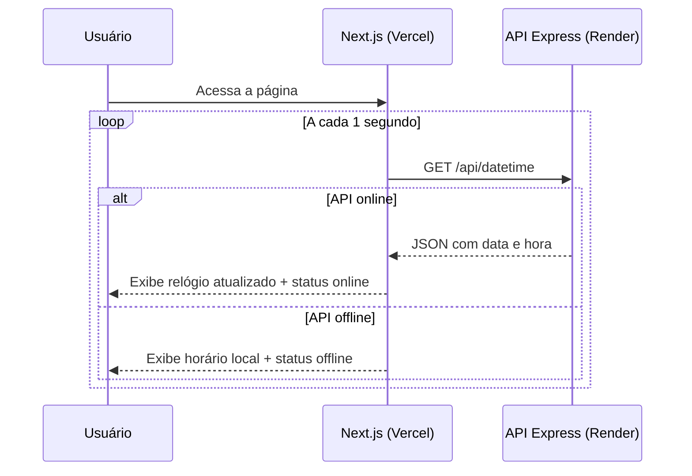

# 🔗 Atividade 4-2 - Projeto Full-Stack (API Express + Frontend Next.js)

> **Disciplina:** Frameworks Front-end
> **Professor:** Prof. Me. Deivison S. Takatu — deivison.takatu@edu.senai.br
> **Tecnologias:** Node.js, Express.js, Next.js, Render e Vercel


## 📑 Índice

1. [Resumo da Atividade](#-resumo-da-atividade)
2. [Sobre o Projeto](#-sobre-o-projeto)
3. [Arquitetura](#-arquitetura)
4. [Tecnologias Utilizadas](#-tecnologias-utilizadas)
5. [API Express](#-api-express-backend)
6. [Frontend Next.js](#-frontend-nextjs)
7. [Deploy](#-deploy--repositórios)
8. [Como Executar Localmente](#-como-executar-localmente)
9. [Checklist da Atividade](#-checklist-da-atividade)

---

## 📝 Resumo da Atividade

A Atividade 4-2 consistiu em construir uma aplicação **full-stack básica** integrando um **back-end em Node.js com Express** e um **front-end em Next.js**. A API REST retorna informações de data e hora formatadas em PT-BR, e o front-end as consome em tempo real — atualizando o relógio a cada 1 segundo via `fetch`. Ambas as camadas foram deployadas na nuvem: a API no **Render** e o front no **Vercel**.

Esta atividade exercita os conceitos de **arquitetura cliente-servidor, consumo de APIs REST, hooks do React (`useState`, `useEffect`), CORS e deploy full-stack** abordados na Aula 4 - Integração Front-end com APIs.

## 🎯 Sobre o Projeto

O projeto é um **relógio em tempo real** que:

- Exibe a **data por extenso** em português (ex.: `quarta-feira, 2 de setembro de 2026`).
- Exibe a **hora atual** (`HH:MM:SS`) atualizada a cada 1 segundo.
- Mostra um **indicador de status** da API (🟢 online / 🔴 offline / 🟡 conectando).
- Implementa um **fallback automático**: se a API estiver indisponível (cold-start do Render), usa o horário local do navegador via `new Date()`.
- Exibe o **timestamp ISO 8601** completo no rodapé.

## 🏗️ Arquitetura

```
┌──────────────────────────────┐          ┌──────────────────────────────────────┐
│  Frontend (Next.js / Vercel) │ ───────▶ │   API Express (Node.js / Render)     │
│  Consulta a cada 1 segundo   │  HTTP    │   GET /api/datetime → JSON           │
│  com fallback local          │ ◀─────── │   https://projeto-api-express-3wvj…  │
└──────────────────────────────┘          └──────────────────────────────────────┘
```



## 🛠️ Tecnologias Utilizadas

### Back-end (API)
- **Node.js** — ambiente de execução JavaScript no servidor.
- **Express.js** — framework web minimalista para criação de rotas REST.
- **CORS** — middleware para habilitar requisições cross-origin do front-end.
- **Nodemon** — hot-reload durante o desenvolvimento.
- **Render** — plataforma de deploy do serviço Node.js.

### Front-end
- **Next.js 16** — framework React com App Router, SSR e otimizações de produção.
- **React Hooks** — `useState` para estado e `useEffect` para ciclo de vida/fetch.
- **CSS Modules** — estilos escopados por componente (`DateTimeCard.module.css`).
- **Fonte Outfit** (Google Fonts) — tipografia moderna.
- **Vercel** — plataforma de deploy do front-end.

## ⚙️ API Express (Backend)

**Repositório:** https://github.com/Felipe-Pinheiro-Lopes/projeto-api-express
**Deploy (Render):** https://projeto-api-express-3wvj.onrender.com

### Endpoints

| Método | Rota | Descrição |
| --- | --- | --- |
| `GET` | `/` | Status da API e lista de endpoints disponíveis |
| `GET` | `/api/datetime` | Retorna data e hora completa em formato PT-BR |

### Exemplo de Resposta — `GET /api/datetime`

```json
{
  "iso": "2026-09-02T23:24:51.093Z",
  "timestamp": 1788391491093,
  "data": "quarta-feira, 2 de setembro de 2026",
  "hora": "20:24:51",
  "timezone": "America/Sao_Paulo",
  "utcOffset": 180,
  "componentes": {
    "ano": 2026,
    "mes": 9,
    "dia": 2,
    "hora": 20,
    "minuto": 24,
    "segundo": 51
  }
}
```

### Estrutura do Projeto (API)

```
projeto-api-express/
├── index.js          # Servidor Express, rotas e configuração CORS
├── package.json      # Dependências: express, cors, nodemon
└── .gitignore
```

> [!NOTE]
> O plano gratuito do Render entra em modo inativo após 15 min sem requisições. A primeira chamada pode demorar até ~30s para o servidor "acordar" (cold-start). O front-end exibe o status "conectando" durante esse período.

## 🖥️ Frontend Next.js

**Repositório:** https://github.com/Felipe-Pinheiro-Lopes/projeto-api-react
**Deploy (Vercel):** https://projeto-api-react.vercel.app/

### Funcionalidades

- ⏱️ **Relógio em tempo real** — atualizado a cada 1 segundo via `fetch` na API.
- 🌐 **Integração com API externa** — consome `https://projeto-api-express-3wvj.onrender.com/api/datetime`.
- 🔄 **Fallback automático** — se a API estiver offline, usa `new Date()` do navegador.
- 📡 **Indicador de status** — badge dinâmico mostrando se a API está *online*, *offline* ou *conectando*.
- 📅 **Data por extenso** — ex.: `Quarta-feira, 2 de setembro de 2026`.
- 🕐 **ISO 8601** — timestamp completo exibido no rodapé.
- 📱 **Responsivo** — layout adaptado para mobile e desktop.

### Estrutura do Projeto (Frontend)

```
projeto-api-react/
├── app/
│   ├── layout.js           # Layout raiz com metadados SEO
│   ├── page.js             # Página principal
│   └── globals.css         # Design tokens e reset global
├── components/
│   ├── DateTimeCard.js     # Componente principal ('use client')
│   └── DateTimeCard.module.css  # Estilos do componente
└── public/
```

### Trecho Principal — `DateTimeCard.js`

```jsx
'use client';
import { useState, useEffect } from 'react';

export default function DateTimeCard() {
  const [data, setData] = useState(null);
  const [status, setStatus] = useState('conectando');

  useEffect(() => {
    const fetchData = async () => {
      try {
        const res = await fetch('https://projeto-api-express-3wvj.onrender.com/api/datetime');
        const json = await res.json();
        setData(json);
        setStatus('online');
      } catch {
        setData({ hora: new Date().toLocaleTimeString('pt-BR') });
        setStatus('offline');
      }
    };

    fetchData();
    const interval = setInterval(fetchData, 1000);
    return () => clearInterval(interval);
  }, []);

  // ... renderização
}
```

## 🚀 Deploy & Repositórios

| Camada | Repositório | Deploy | URL |
| --- | --- | --- | --- |
| ⚙️ API (Backend) | [projeto-api-express](https://github.com/Felipe-Pinheiro-Lopes/projeto-api-express) | Render | https://projeto-api-express-3wvj.onrender.com |
| 🖥️ Frontend | [projeto-api-react](https://github.com/Felipe-Pinheiro-Lopes/projeto-api-react) | Vercel | https://projeto-api-react.vercel.app/ |

## ▶️ Como Executar Localmente

### API Express

```bash
git clone https://github.com/Felipe-Pinheiro-Lopes/projeto-api-express.git
cd projeto-api-express
npm install
npm run dev     # Modo desenvolvimento com Nodemon
# ou
npm start       # Modo produção
```

Acesse: http://localhost:3000/api/datetime

### Frontend Next.js

```bash
git clone https://github.com/Felipe-Pinheiro-Lopes/projeto-api-react.git
cd projeto-api-react
npm install
npm run dev
```

Acesse: http://localhost:3000

> [!TIP]
> Para testar a integração local completa, suba a API Express primeiro (porta 3000) e configure a URL no componente `DateTimeCard.js` para `http://localhost:3000/api/datetime` antes de rodar o frontend.

## ✅ Checklist da Atividade

- [x] Criar a API REST com Node.js e Express
- [x] Configurar CORS para permitir requisições do front-end
- [x] Implementar o endpoint `GET /api/datetime` com resposta em PT-BR
- [x] Realizar o deploy da API no Render
- [x] Criar o frontend Next.js com App Router
- [x] Implementar o componente `DateTimeCard` com `useState` e `useEffect`
- [x] Configurar o `fetch` para consumir a API a cada 1 segundo
- [x] Implementar o fallback local com `new Date()`
- [x] Implementar o indicador de status da API (online/offline/conectando)
- [x] Realizar o deploy do frontend na Vercel
- [x] Versionar ambos os repositórios no GitHub
- [x] Documentar a atividade neste arquivo Markdown
