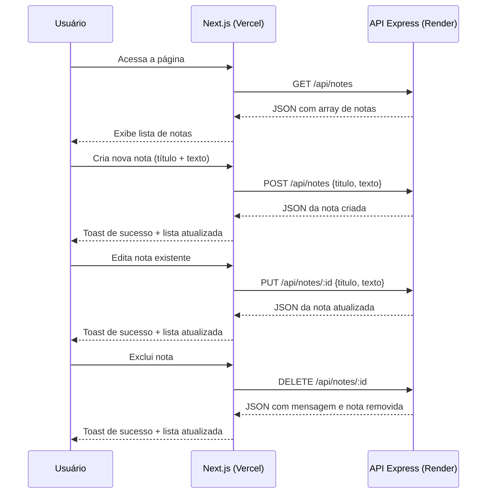

# 🔗 Atividade 5-2 - CRUD de Notas (API Express + Frontend Next.js)

> **Disciplina:** Frameworks Front-end
> **Professor:** Prof. Me. Deivison S. Takatu — deivison.takatu@edu.senai.br
> **Tecnologias:** Node.js, Express.js, Next.js, Render e Vercel


## 📑 Índice

1. [Resumo da Atividade](#-resumo-da-atividade)
2. [Sobre o Projeto](#-sobre-o-projeto)
3. [Arquitetura](#-arquitetura)
4. [Tecnologias Utilizadas](#-tecnologias-utilizadas)
5. [API Express](#-api-express-backend)
6. [Frontend Next.js](#-frontend-nextjs)
7. [Deploy](#-deploy--repositórios)
8. [Como Executar Localmente](#-como-executar-localmente)
9. [Checklist da Atividade](#-checklist-da-atividade)

---

## 📝 Resumo da Atividade

A Atividade 5-2 consistiu em construir uma aplicação **full-stack com CRUD completo** integrando um **back-end em Node.js com Express** e um **front-end em Next.js**. A API REST gerencia notas com operações de criar, listar, editar e excluir, com persistência local em `data.json` e IDs gerados com UUID. O front-end consome a API em tempo real, permitindo ao usuário gerenciar suas notas com feedback visual. Ambas as camadas foram deployadas na nuvem: a API no **Render** e o front no **Vercel**.

Esta atividade exercita os conceitos de **operacões CRUD, middlewares, CORS, manipulação de arquivos JSON com Node.js, geração de IDs únicos, hooks do React (`useState`, `useEffect`) e deploy full-stack** abordados na Aula 5 - Criando APIs para o Front-end.

## 🎯 Sobre o Projeto

O projeto é um **gerenciador de notas** que permite ao usuário:

- 📋 **Listar** todas as notas cadastradas.
- ➕ **Criar** nova nota com título e texto.
- ✏️ **Editar** nota existente.
- 🗑️ **Excluir** nota com confirmação.
- ✅ **Feedback visual** com toasts de sucesso e erro.
- 📱 **Layout responsivo** adaptado para mobile e desktop.

## 🏗️ Arquitetura

```
┌──────────────────────────────┐          ┌──────────────────────────────────────┐
│  Frontend (Next.js / Vercel) │ ───────▶ │   API Express (Node.js / Render)     │
│  CRUD completo via fetch     │  HTTP    │   POST /api/notes → cria nota        │
│  com feedback visual         │ ◀─────── │   GET /api/notes → lista notas       │
│                              │          │   PUT /api/notes/:id → edita nota    │
│                              │          │   DELETE /api/notes/:id → exclui     │
└──────────────────────────────┘          └──────────────────────────────────────┘
```



## 🛠️ Tecnologias Utilizadas

### Back-end (API)
- **Node.js** — ambiente de execução JavaScript no servidor.
- **Express.js** — framework web minimalista para criação de rotas REST.
- **CORS** — middleware para habilitar requisições cross-origin do front-end.
- **UUID** — biblioteca para geração de identificadores únicos.
- **fs (file system)** — módulo nativo do Node.js para leitura e escrita de `data.json`.
- **Render** — plataforma de deploy do serviço Node.js.

### Front-end
- **Next.js 16** — framework React com App Router e otimizações de produção.
- **React Hooks** — `useState` para estado e `useEffect` para ciclo de vida/fetch.
- **CSS customizado** — design tokens, glassmorphism, dark mode e layout responsivo.
- **Fonte Outfit** (Google Fonts) — tipografia moderna.
- **Vercel** — plataforma de deploy do front-end.

## ⚙️ API Express (Backend)

**Repositório:** https://github.com/Felipe-Pinheiro-Lopes/aula5-api-notas
**Deploy (Render):** https://aula5-api-notas.onrender.com/

### Endpoints

| Método | Rota | Descrição |
| --- | --- | --- |
| `GET` | `/` | Status da API e lista de endpoints disponíveis |
| `GET` | `/api/notes` | Lista todas as notas |
| `GET` | `/api/notes/:id` | Busca uma nota por ID |
| `POST` | `/api/notes` | Cria uma nova nota (body: `titulo`, `texto`) |
| `PUT` | `/api/notes/:id` | Edita uma nota existente (body: `titulo`, `texto`) |
| `DELETE` | `/api/notes/:id` | Exclui uma nota por ID |

### Exemplo de Corpo da Requisição — `POST /api/notes` e `PUT /api/notes/:id`

```json
{
  "titulo": "Lembretes",
  "texto": "Comprar leite e pão"
}
```

### Exemplo de Resposta — `GET /api/notes`

```json
[
  {
    "id": "1a2b3c4d-0000-0000-0000-000000000001",
    "titulo": "Lembretes",
    "texto": "Comprar leite e pão",
    "criadoEm": "2026-04-28T10:00:00Z",
    "atualizadoEm": "2026-04-28T10:00:00Z"
  },
  {
    "id": "1a2b3c4d-0000-0000-0000-000000000002",
    "titulo": "Tarefas do trabalho",
    "texto": "Enviar relatório até sexta-feira",
    "criadoEm": "2026-04-28T10:00:00Z",
    "atualizadoEm": "2026-04-28T10:00:00Z"
  }
]
```

### Estrutura do Projeto (API)

```
aula5-api-notas/
├── server.js          # Servidor Express, rotas CRUD e configuração CORS
├── data.json          # Persistência local das notas
├── package.json       # Dependências: express, cors, uuid, nodemon
└── .gitignore
```

## 🖥️ Frontend Next.js

**Repositório:** https://github.com/Felipe-Pinheiro-Lopes/aula5-frontend-notas
**Deploy (Vercel):** https://aula5-frontend-notas.vercel.app/

### Funcionalidades

- 📋 **Listar notas** — carrega todas as notas da API ao abrir a página.
- ➕ **Criar nota** — formulário com título e texto, validação e feedback visual.
- ✏️ **Editar nota** — pré-popula o formulário com dados da nota selecionada.
- 🗑️ **Excluir nota** — botão com confirmação antes de remover.
- ✅ **Feedback visual** — toasts de sucesso/erro e estados de loading.
- 📱 **Layout responsivo** — adaptado para mobile e desktop.

### Estrutura do Projeto (Frontend)

```
aula5-frontend-notas/
├── app/
│   ├── layout.js           # Layout raiz com metadados SEO
│   ├── page.js             # Página principal
│   └── globals.css         # Design tokens, reset e estilos globais
├── components/
│   ├── NoteForm.jsx        # Formulário de criar/editar nota
│   ├── NoteList.jsx        # Lista de notas com estados de loading/erro
│   └── NoteCard.jsx        # Card individual da nota com ações
├── services/
│   └── api.js              # Funções de comunicação com a API (fetch)
├── .env.local              # Variável NEXT_PUBLIC_API_URL
├── package.json
└── next.config.js
```

### Trecho Principal — `services/api.js`

```javascript
const API_URL = process.env.NEXT_PUBLIC_API_URL || 'http://localhost:3000/api/notes';

export async function getNotes() {
  const res = await fetch(API_URL, { cache: 'no-store' });
  if (!res.ok) throw new Error('Erro ao buscar notas');
  return res.json();
}

export async function createNote(titulo, texto) {
  const res = await fetch(API_URL, {
    method: 'POST',
    headers: { 'Content-Type': 'application/json' },
    body: JSON.stringify({ titulo, texto }),
  });
  if (!res.ok) throw new Error('Erro ao criar nota');
  return res.json();
}

export async function updateNote(id, titulo, texto) {
  const res = await fetch(`${API_URL}/${id}`, {
    method: 'PUT',
    headers: { 'Content-Type': 'application/json' },
    body: JSON.stringify({ titulo, texto }),
  });
  if (!res.ok) throw new Error('Erro ao editar nota');
  return res.json();
}

export async function deleteNote(id) {
  const res = await fetch(`${API_URL}/${id}`, { method: 'DELETE' });
  if (!res.ok) throw new Error('Erro ao excluir nota');
  return res.json();
}
```

## 🚀 Deploy & Repositórios

| Camada | Repositório | Deploy | URL |
| --- | --- | --- | --- |
| ⚙️ API (Backend) | [aula5-api-notas](https://github.com/Felipe-Pinheiro-Lopes/aula5-api-notas) | Render | https://aula5-api-notas.onrender.com/ |
| 🖥️ Frontend | [aula5-frontend-notas](https://github.com/Felipe-Pinheiro-Lopes/aula5-frontend-notas) | Vercel | https://aula5-frontend-notas.vercel.app/ |

## ▶️ Como Executar Localmente

### API Express

```bash
git clone https://github.com/Felipe-Pinheiro-Lopes/aula5-api-notas.git
cd aula5-api-notas
npm install
npm run dev     # Modo desenvolvimento com Nodemon
# ou
npm start       # Modo produção
```

Acesse: http://localhost:3000/api/notes

### Frontend Next.js

```bash
git clone https://github.com/Felipe-Pinheiro-Lopes/aula5-frontend-notas.git
cd aula5-frontend-notas
npm install
npm run dev
```

Acesse: http://localhost:3000

> [!TIP]
> Para testar a integração local completa, suba a API Express primeiro (porta 3000) e configure a variável `NEXT_PUBLIC_API_URL` para `http://localhost:3000/api/notes` antes de rodar o frontend.

## ✅ Checklist da Atividade

- [x] Criar a API REST com Node.js e Express
- [x] Configurar middlewares CORS e `express.json()`
- [x] Implementar operações CRUD em `/api/notes`
- [x] Implementar persistência local com `data.json`
- [x] Gerar IDs únicos com a biblioteca `uuid`
- [x] Realizar o deploy da API no Render
- [x] Criar o frontend Next.js com App Router
- [x] Implementar componentes `NoteForm`, `NoteList` e `NoteCard`
- [x] Criar serviço `api.js` com funções `getNotes`, `createNote`, `updateNote`, `deleteNote`
- [x] Implementar feedback visual e tratamento de erros
- [x] Realizar o deploy do frontend na Vercel
- [x] Versionar ambos os repositórios no GitHub
- [x] Documentar a atividade neste arquivo Markdown
