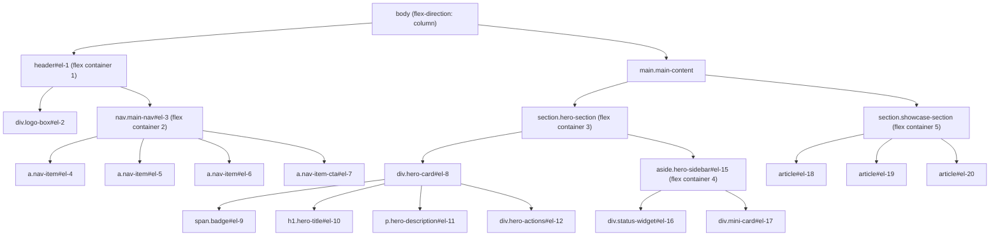

# 📦 Atividade 7-1 - Estudo de Box Model & Flexbox (HTML & CSS Puro)

> **Disciplina:** Frameworks Front-end
> **Professor:** Prof. Me. Deivison S. Takatu — deivison.takatu@edu.senai.br
> **Tecnologias:** HTML5, CSS3 (Vanilla)


## 📑 Índice

1. [Resumo da Atividade](#-resumo-da-atividade)
2. [Sobre o Projeto](#-sobre-o-projeto)
3. [Arquitetura e Estrutura](#-arquitetura-e-estrutura)
4. [Tecnologias Utilizadas](#-tecnologias-utilizadas)
5. [Box Model nos 20 Elementos](#-box-model-nos-20-elementos)
6. [Propriedades de Flexbox](#-propriedades-de-flexbox)
7. [Responsividade](#-responsividade)
8. [Repositório & Como Executar](#-repositório--como-executar)
9. [Checklist da Atividade](#-checklist-da-atividade)

---

## 📝 Resumo da Atividade

A Atividade 7-1 consistiu em desenvolver uma página web completa em **HTML5 e CSS3 puro (Vanilla CSS)** para demonstrar dois pilares fundamentais do CSS: o **Box Model** e o **CSS Flexbox**. O projeto aplica rigorosamente as quatro camadas do Box Model (*Content, Padding, Border, Margin*) em **20 elementos HTML** distintos e utiliza **27 propriedades de Flexbox** para criar um layout responsivo moderno com Dark Theme e estética Glassmorphism.

Esta atividade exercita os conceitos de **estilização externa CSS via `<link>`, propriedades do Box Model, posicionamento com Flexbox, responsividade com Media Queries e design moderno** abordados na Aula 7 - Frameworks CSS.

## 🎯 Sobre o Projeto

O projeto **"Estudo Prático: Box Model & Flexbox 20x20"** é uma interface educativa que demonstra:

- 📐 **Box Model** aplicado a cada um dos 20 elementos com `Content`, `Padding`, `Border` e `Margin` distintos.
- 💪 **27 propriedades de Flexbox** em uso real dentro de um layout funcional.
- 🌙 **Dark Theme** com paleta escura sofisticada e variáveis CSS.
- ✨ **Glassmorphism** com `backdrop-filter: blur()` e bordas com opacidade.
- 📱 **Layout responsivo** via Media Queries (`max-width: 768px`).
- 🔤 **Tipografia** com Google Fonts (*Plus Jakarta Sans*).

## 🏗️ Arquitetura e Estrutura

```
estudo_html_css/
├── index.html        # Estrutura HTML com os 20 elementos semânticos
├── style.css         # Folha de estilos com Box Model e Flexbox (CSS externo)
└── README.md         # Documentação completa do projeto
```

### Hierarquia de Flexbox Containers



## 🛠️ Tecnologias Utilizadas

- **HTML5** — Estrutura semântica com `<header>`, `<nav>`, `<main>`, `<section>`, `<article>`, `<aside>`, `<footer>`.
- **CSS3 (Vanilla)** — Estilização externa com `style.css` carregada via `<link rel="stylesheet">`.
  - CSS Custom Properties (variáveis `--primary`, `--accent`, `--border-color`)
  - CSS Box Model completo (Content, Padding, Border, Margin)
  - CSS Flexbox com 27 propriedades
  - Media Queries para responsividade
  - `backdrop-filter: blur()` para efeito Glassmorphism
- **Google Fonts** — Tipografia *Plus Jakarta Sans* (pesos 400–800).

## 📐 Box Model nos 20 Elementos

Cada um dos 20 elementos possui configuração explícita das quatro camadas do Box Model:

| ID | Elemento / Componente | Content (Dimensões) | Padding | Border | Margin |
|:---:|:---|:---:|:---:|:---:|:---:|
| `#el-1` | `header.app-header` | `width: 100%; min-height: 80px` | `18px 36px` | `2px solid` (inferior) | `0 0 24px 0` |
| `#el-2` | `div.logo-box` | `height: 48px; auto` | `6px 14px` | `1px solid` | `0 12px 0 0` |
| `#el-3` | `nav.main-nav` | `min-height: 44px` | `4px 8px` | `1px solid rgba(…,0.05)` | `0` |
| `#el-4` | `a.nav-item (Início)` | `inline-block` | `8px 16px` | `1px solid transparent` | `0 4px` |
| `#el-5` | `a.nav-item (Elementos)` | `inline-block` | `8px 16px` | `1px solid transparent` | `0 4px` |
| `#el-6` | `a.nav-item (Métricas)` | `inline-block` | `8px 16px` | `1px solid transparent` | `0 4px` |
| `#el-7` | `a.nav-item-cta (Explorar)` | `inline-block` | `8px 20px` | `1px solid var(--primary)` | `0 0 0 8px` |
| `#el-8` | `div.hero-card` | `width: 100%; min-width: 320px` | `40px` | `1px solid` | `0 0 16px 0` |
| `#el-9` | `span.badge` | `inline-flex` | `6px 14px` | `1px solid rgba(6,182,212,0.3)` | `0 0 8px 0` |
| `#el-10` | `h1.hero-title` | `width: 100%` | `4px 0 4px 12px` | `4px solid var(--primary)` (lateral) | `4px 0 12px 0` |
| `#el-11` | `p.hero-description` | `max-width: 680px` | `12px 16px` | `1px dashed rgba(…,0.1)` | `0 0 16px 0` |
| `#el-12` | `div.hero-actions` | `width: 100%` | `10px 0` | `1px solid rgba(…,0.05)` (topo) | `8px 0 0 0` |
| `#el-13` | `button.btn-primary` | `height: 46px` | `0 24px` | `1px solid var(--primary)` | `0 4px 0 0` |
| `#el-14` | `button.btn-outline` | `height: 46px` | `0 24px` | `1px solid` | `0` |
| `#el-15` | `aside.hero-sidebar` | `width: 100%` | `24px` | `1px solid` | `0` |
| `#el-16` | `div.status-widget` | `width: 100%` | `16px` | `1px solid rgba(16,185,129,0.3)` | `0 0 8px 0` |
| `#el-17` | `div.mini-card` | `width: 100%` | `16px` | `3px solid var(--accent)` (lateral) | `6px 0 0 0` |
| `#el-18` | `article.card-highlight` | `min-width: 260px; min-height: 220px` | `24px` | `2px solid var(--border-accent)` | `8px` |
| `#el-19` | `article.card-align-self` | `min-width: 260px; min-height: 220px` | `24px` | `1px solid` | `8px` |
| `#el-20` | `article.card-order` | `min-width: 260px; min-height: 220px` | `24px` | `1px dashed var(--accent)` | `8px` |

## 💪 Propriedades de Flexbox

O projeto aplica **27 declarações de Flexbox** em uso real dentro do layout:

| # | Propriedade | Valor(es) Aplicado(s) | Onde / Efeito |
|:---:|:---|:---:|:---|
| 1 | `display: flex` | — | Múltiplos containers flex |
| 2 | `display: inline-flex` | — | Badges, botões e logo |
| 3 | `flex-direction` | `row` | Orientação horizontal padrão |
| 4 | `flex-direction` | `column` | Cards e layout body/mobile |
| 5 | `flex-wrap` | `wrap` | Quebra de linha responsiva |
| 6 | `flex-flow` | `row wrap` | Direção + quebra (sintaxe curta) |
| 7 | `justify-content` | `space-between` | Header e hero section |
| 8 | `justify-content` | `flex-start` | Alinhamento inicial |
| 9 | `justify-content` | `flex-end` | Menu de navegação |
| 10 | `justify-content` | `center` | Botões e elementos centrais |
| 11 | `justify-content` | `space-around` | Sidebar |
| 12 | `justify-content` | `space-evenly` | Galeria de cards |
| 13 | `align-items` | `center` | Centralização transversal |
| 14 | `align-items` | `flex-start` | Alinhamento ao topo |
| 15 | `align-items` | `stretch` | Cards e painéis laterais |
| 16 | `align-content` | `space-between` | Múltiplas linhas flex |
| 17 | `gap` | `16px / 24px` | Espaçamento nativo entre itens |
| 18 | `column-gap` | — | Espaçamento exclusivo de colunas |
| 19 | `row-gap` | — | Espaçamento exclusivo de linhas |
| 20 | `flex-grow` | `1` e `2` | Crescimento dinâmico de elementos |
| 21 | `flex-shrink` | `0` e `1` | Preserva dimensões mínimas |
| 22 | `flex-basis` | `280px / 600px` | Dimensão base antes da distribuição |
| 23 | `flex` (shorthand) | `2 1 600px` | Combinação grow + shrink + basis |
| 24 | `align-self` | `flex-end` | `#el-19` — alinhamento individual |
| 25 | `align-self` | `center` | `#el-20` — alinhamento individual |
| 26 | `align-self` | `stretch` | Adaptação no breakpoint mobile |
| 27 | `order` | `-1` | `#el-20` — reordenação visual sem mudar HTML |

## 📱 Responsividade

A página se adapta a telas menores com `@media (max-width: 768px)`:

- O `<header>` reorganiza logo e navegação em coluna (`flex-direction: column`).
- Ações e botões expandem para 100% da largura (`align-items: stretch; width: 100%`).
- As propriedades de `align-self` são reajustadas para preenchimento fluido.
- A hero section empilha o card e a sidebar verticalmente.

## 🔗 Repositório & Como Executar

**Repositório:** [estudo_html_css](https://github.com/Felipe-Pinheiro-Lopes/estudo_html_css)

```bash
# Clone o repositório
git clone https://github.com/Felipe-Pinheiro-Lopes/estudo_html_css.git
cd estudo_html_css

# Abra no navegador:
# Opção 1: Clique duplo no index.html
# Opção 2: Use Live Server no VS Code (recarregamento automático)
```

> [!TIP]
> Para inspecionar as propriedades do Box Model de cada elemento, abra as Ferramentas de Desenvolvedor (`F12`) → aba **Elements** → selecione o elemento → painel **Computed** e visualize o diagrama Box Model.

## ✅ Checklist da Atividade

- [x] Criar a estrutura HTML semântica com `<header>`, `<nav>`, `<main>`, `<section>`, `<article>`, `<aside>` e `<footer>`
- [x] Carregar CSS via arquivo externo (`<link rel="stylesheet" href="style.css">`)
- [x] Configurar Box Model (Content, Padding, Border, Margin) nos 20 elementos (`#el-1` ao `#el-20`)
- [x] Aplicar 27 propriedades distintas de CSS Flexbox
- [x] Implementar Dark Theme com CSS Custom Properties (variáveis)
- [x] Adicionar efeito Glassmorphism com `backdrop-filter: blur()`
- [x] Integrar Google Fonts (*Plus Jakarta Sans*)
- [x] Implementar Media Queries para responsividade mobile (`max-width: 768px`)
- [x] Versionar o projeto no GitHub
- [x] Documentar o projeto no README do repositório
- [x] Criar este resumo da Atividade 7-1 (este arquivo)
