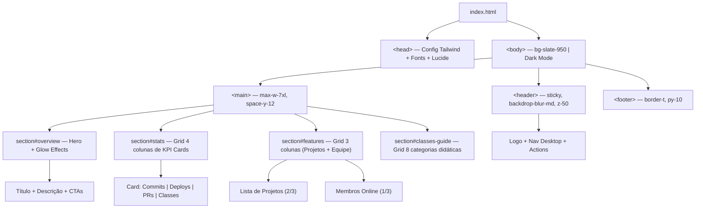

# 🎨 Atividade 7-2 - DevMetrics Dashboard (Tailwind CSS)

> **Disciplina:** Frameworks Front-end
> **Professor:** Prof. Me. Deivison S. Takatu — deivison.takatu@edu.senai.br
> **Tecnologias:** HTML5, Tailwind CSS v3, Google Fonts, Lucide Icons


## 📑 Índice

1. [Resumo da Atividade](#-resumo-da-atividade)
2. [Sobre o Projeto](#-sobre-o-projeto)
3. [Arquitetura e Estrutura](#-arquitetura-e-estrutura)
4. [Tecnologias Utilizadas](#-tecnologias-utilizadas)
5. [Classes Tailwind por Categoria](#-classes-tailwind-por-categoria)
6. [Seções da Interface](#-seções-da-interface)
7. [Repositório & Como Executar](#-repositório--como-executar)
8. [Checklist da Atividade](#-checklist-da-atividade)

---

## 📝 Resumo da Atividade

A Atividade 7-2 consistiu em desenvolver um **dashboard moderno (DevMetrics)** utilizando exclusivamente classes utilitárias do **Tailwind CSS v3** via CDN. O projeto demonstra o uso prático de mais de **45 classes utilitárias** distribuídas em 10 categorias funcionais, aplicadas em uma interface de painel de controle para equipes de engenharia de software com Dark Mode, Glassmorphism e micro-animações.

Esta atividade exercita os conceitos de **framework CSS utilitário, design system via classes utilitárias, responsividade mobile-first, animações e estados interativos com Tailwind CSS** abordados na Aula 7 - Frameworks CSS.

## 🎯 Sobre o Projeto

O **DevMetrics Dashboard** é um painel de controle fictício para equipes de desenvolvimento com:

- 🔧 **Header/Navbar Sticky** com efeito *Glassmorphism* (`backdrop-blur-md`), gradiente de marca e badge.
- 🚀 **Hero Section** com iluminação de fundo (*radial glow*), tipografia escalonada e botões interativos.
- 📊 **Cards de Métricas** em grid responsivo (commits, taxa de sucesso de deploys, PRs pendentes e classes utilizadas).
- 🏗️ **Painel Misto** com lista de projetos (Grid + Flexbox) e card de membros online.
- 📖 **Guia Didático** com 8 categorias de classes documentadas diretamente na interface.

## 🏗️ Arquitetura e Estrutura

```
estudo_class_tailwind/
├── index.html      # Documento único com a interface completa e guia didático
└── README.md       # Documentação completa do projeto
```

### Fluxo de Composição da Interface



## 🛠️ Tecnologias Utilizadas

- **HTML5** — Estrutura semântica com `<header>`, `<main>`, `<section>`, `<nav>`, `<footer>`.
- **Tailwind CSS v3 (CDN)** — Framework CSS utilitário com configuração customizada:
  - `darkMode: 'class'` para Dark Mode explícito via classe `dark`.
  - `fontFamily.sans` estendida com `Inter`.
  - Paleta de cores `brand` customizada (tons de indigo).
- **Google Fonts (Inter)** — Pesos 300 a 800 carregados via CDN.
- **Lucide Icons** — Ícones vetoriais leves via CDN (`lucide.createIcons()`).

### Configuração Tailwind Customizada

```javascript
tailwind.config = {
  darkMode: 'class',
  theme: {
    extend: {
      fontFamily: {
        sans: ['Inter', 'sans-serif'],
      },
      colors: {
        brand: {
          50: '#eef2ff',
          100: '#e0e7ff',
          500: '#6366f1',
          600: '#4f46e5',
          700: '#4338ca',
        }
      }
    }
  }
}
```

## 📋 Classes Tailwind por Categoria

O projeto utiliza **mais de 45 classes utilitárias** distribuídas em 10 categorias:

### 1. Cores e Gradientes
| Classe | Função |
|:---|:---|
| `bg-slate-950` | Fundo base escuro da página |
| `bg-slate-900/60` | Background de containers com 60% de opacidade |
| `bg-indigo-600` | Cor primária de botões e destaque |
| `bg-indigo-500/10` | Fundo translúcido para badges de ícone |
| `text-slate-100` / `text-slate-400` | Hierarquia de tons de texto |
| `text-emerald-400` / `text-amber-400` | Cores semânticas de status |
| `bg-gradient-to-r` / `bg-gradient-to-tr` | Gradientes lineares direcionados |
| `from-indigo-600` / `to-violet-500` | Cores de início e fim do gradiente |
| `bg-clip-text` + `text-transparent` | Gradiente aplicado como máscara de texto |

### 2. Tipografia
| Classe | Função |
|:---|:---|
| `text-xs` / `text-sm` / `text-xl` / `text-5xl` | Escala tipográfica modular |
| `font-medium` / `font-semibold` / `font-extrabold` | Pesos de fonte |
| `tracking-tight` / `tracking-wider` | Espaçamento entre caracteres |
| `leading-relaxed` / `leading-tight` | Altura de linha |
| `uppercase` | Transformação de texto em maiúsculas |
| `antialiased` | Suavização de renderização de fontes |

### 3. Espaçamento (Padding, Margin, Gap)
| Classe | Função |
|:---|:---|
| `p-6` / `p-8` / `p-12` | Padding uniforme interno |
| `px-4` / `px-6` / `px-8` | Padding horizontal |
| `py-2` / `py-10` | Padding vertical |
| `mx-auto` | Centralização horizontal automática |
| `gap-4` / `gap-6` | Espaçamento entre itens em Grid/Flex |
| `space-x-2` / `space-x-4` | Espaçamento horizontal entre filhos |
| `space-y-6` / `space-y-12` | Espaçamento vertical entre filhos |

### 4. Dimensões
| Classe | Função |
|:---|:---|
| `w-full` | Largura de 100% |
| `max-w-7xl` / `max-w-3xl` | Largura máxima de containeres |
| `min-h-screen` | Altura mínima de 100vh |
| `h-16` / `w-10` / `h-10` | Alturas e larguras fixas |

### 5. Bordas, Anéis e Sombras
| Classe | Função |
|:---|:---|
| `rounded-xl` / `rounded-2xl` / `rounded-3xl` / `rounded-full` | Raios de curvatura |
| `border` / `border-b` / `border-t` | Bordas gerais ou direcionais |
| `border-slate-800` | Cor de borda escura |
| `ring-1` / `ring-white/20` | Efeito de anel/contorno |
| `shadow-lg` / `shadow-xl` | Elevações e sombras |
| `shadow-indigo-500/30` | Sombra colorida com opacidade |
| `divide-y` / `divide-slate-800` | Linhas divisórias automáticas |

### 6. Posicionamento e Camadas
| Classe | Função |
|:---|:---|
| `relative` / `absolute` / `sticky` | Modos de posicionamento |
| `top-0` / `-top-24` / `right-1.5` | Coordenadas de posicionamento |
| `z-10` / `z-50` | Controle de profundidade (z-index) |
| `overflow-hidden` / `overflow-x-auto` | Controle de estouro de conteúdo |
| `pointer-events-none` | Isola elementos decorativos |

### 7. Flexbox
| Classe | Função |
|:---|:---|
| `flex` / `inline-flex` | Ativa container Flexbox |
| `items-center` / `items-baseline` | Alinhamento no eixo cruzado |
| `justify-between` / `justify-center` | Alinhamento no eixo principal |
| `flex-col` / `flex-row` | Direção do fluxo |

### 8. CSS Grid
| Classe | Função |
|:---|:---|
| `grid` | Ativa container CSS Grid |
| `grid-cols-1` | 1 coluna (mobile-first) |
| `lg:col-span-2` | Item ocupa 2 colunas |
| `lg:grid-cols-3` / `lg:grid-cols-4` | Número de colunas por breakpoint |

### 9. Responsividade (Mobile-First)
| Prefixo | Exemplos Aplicados |
|:---|:---|
| `sm:` (≥640px) | `sm:px-6`, `sm:p-12`, `sm:text-5xl`, `sm:grid-cols-2`, `sm:flex-row` |
| `md:` (≥768px) | `md:flex`, `md:grid-cols-2` |
| `lg:` (≥1024px) | `lg:px-8`, `lg:grid-cols-3`, `lg:grid-cols-4`, `lg:col-span-2` |

### 10. Estados Interativos e Animações
| Classe | Função |
|:---|:---|
| `hover:bg-slate-800` / `hover:text-white` | Estilos ao passar o mouse |
| `hover:border-indigo-500/50` | Transição suave de borda |
| `hover:scale-[1.02]` / `hover:-translate-y-0.5` | Micro-elevação |
| `active:scale-[0.98]` | Feedback tátil de clique |
| `group` + `group-hover:scale-110` | Animação de filho baseada no pai |
| `transition-all` / `duration-300` | Transições suaves de 300ms |
| `backdrop-blur-md` | Efeito Glassmorphism |
| `animate-pulse` | Animação de pulso para indicadores ativos |

## 🖥️ Seções da Interface

### Header Sticky
```html
<header class="sticky top-0 z-50 backdrop-blur-md bg-slate-900/80 border-b border-slate-800/80">
```
- Logo com gradiente + badge de versão
- Navegação desktop com links por ancla
- Botões de ação (notificação com pulso + "Novo Projeto")

### Hero Section
```html
<section class="relative overflow-hidden rounded-3xl bg-gradient-to-b from-slate-900 ...">
```
- Efeitos *radial glow* com `blur-3xl` e `pointer-events-none`
- Título com gradiente de texto (`bg-clip-text text-transparent`)
- Dois CTAs: primário (gradiente) e secundário (outline)

### Cards de Métricas (KPI)
```html
<div class="grid grid-cols-1 sm:grid-cols-2 lg:grid-cols-4 gap-4 sm:gap-6">
```
- 4 cards responsivos com hover e elevação de sombra colorida
- Cada card: ícone Lucide, valor destacado, variação percentual e subtítulo

### Painel de Projetos e Equipe
```html
<section class="grid grid-cols-1 lg:grid-cols-3 gap-6">
```
- Coluna principal (2/3): lista de projetos com status operacional, versão e timestamp
- Coluna lateral (1/3): lista de membros online com avatares e dica de produtividade

### Guia Didático de Classes
```html
<div class="grid grid-cols-1 md:grid-cols-2 lg:grid-cols-4 gap-4">
```
- 8 cards, um por categoria funcional de classes
- Cada classe listada com `font-mono` e destaque de cor temático

## 🔗 Repositório & Como Executar

**Repositório:** [estudo_class_tailwind](https://github.com/Felipe-Pinheiro-Lopes/estudo_class_tailwind)

```bash
# Clone o repositório
git clone https://github.com/Felipe-Pinheiro-Lopes/estudo_class_tailwind.git
cd estudo_class_tailwind

# Abra no navegador:
# Opção 1: Clique duplo no index.html
# Opção 2: Use Live Server no VS Code
```

> [!NOTE]
> O projeto utiliza Tailwind CSS via CDN, portanto não requer instalação de dependências, build ou configuração de ambiente Node.js. Basta abrir o `index.html` em qualquer navegador moderno.

## ✅ Checklist da Atividade

- [x] Configurar o Tailwind CSS via CDN com `darkMode: 'class'`
- [x] Criar configuração customizada (cor `brand`, fonte `Inter`)
- [x] Aplicar mais de 45 classes utilitárias em pelo menos 8 categorias distintas
- [x] Implementar layout responsivo com prefixos `sm:`, `md:` e `lg:`
- [x] Criar grid de KPI cards responsivo (1 → 2 → 4 colunas)
- [x] Implementar Glassmorphism com `backdrop-blur-md` e opacidade
- [x] Adicionar estados interativos com `hover:`, `active:` e `group`
- [x] Integrar ícones Lucide via CDN
- [x] Criar seção didática documentando todas as classes utilizadas
- [x] Implementar efeitos de glow decorativos com `blur-3xl`
- [x] Versionar o projeto no GitHub
- [x] Documentar o projeto no README do repositório
- [x] Criar este resumo da Atividade 7-2 (este arquivo)
