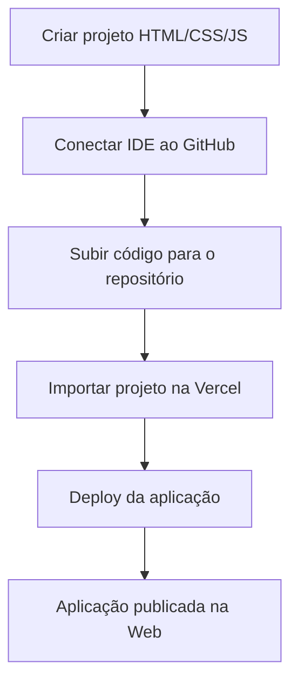

# 📘 Aula 1 - Vanilla JS

> **Disciplina:** Frameworks Front-end
> **Professor:** Prof. Me. Deivison S. Takatu — deivison.takatu@edu.senai.br

## 📑 Índice

1. [Resumo](#-resumo)
2. [Tópicos Abordados](#-tópicos-abordados)
3. [Atividades Apresentadas](#-atividades-apresentadas)
4. [Repositório de Exemplo](#-repositorio-de-exemplo-atividade-01)
5. [Checklist da Aula](#-checklist-da-aula)

---

## 📝 Resumo

A primeira aula foi dedicada à **apresentação da disciplina** e à **contextualização** do desenvolvimento Front-end, estabelecendo a base conceitual para o semestre. O destaque prático foi o **Vanilla JS**, tema central da Atividade 01.

## 📚 Tópicos Abordados

### 1. 🎓 Apresentação da disciplina e do professor
- O professor apresentou sua trajetória (Mestre em Ciência da Computação, especialização em IA, atuação como Gerente de Projetos e Professor Universitário).
- Apresentação da turma (expectativas, experiências e hobbies) via Padlet.

### 2. 📋 Plano de ensino
Foram apresentados os elementos do plano de aulas:
- Objetivos de aprendizagem;
- Ementa;
- Conteúdo programático;
- Metodologia de ensino;
- Recursos didáticos;
- Avaliação;
- Bibliografia.

### 3. 🧭 Contexto da disciplina
- O Front-end é um **requisito estratégico** para a competitividade empresarial.
- Envolve a **arquitetura de software** e a interligação das partes de uma aplicação.
- A maioria das aplicações web modernas utiliza algum framework Front-end, pois as empresas precisam de interfaces rápidas, organizadas e fáceis de manter.

### 4. 💻 O que é Desenvolvimento Front-end?
- É a camada da aplicação com a qual o **usuário interage diretamente**.
- Responsável pela criação de interfaces, organização visual, experiência do usuário (UX) e comunicação com os sistemas de processamento de dados.
- Conceitos relacionados: escopo, prototipação, UX/UI, arquitetura de um site e versionamento/deploy.

### 5. 🟨 Introdução ao JavaScript (Vanilla JS)
- **JavaScript:** linguagem de script interpretada, essencial no front-end.
- **Vanilla JS:** JavaScript puro, sem dependências externas, base de todas as abstrações.
- **Importância:** manipulação de páginas, comunicação com servidores e lógica de interface.

### 6. 🎯 O que estudaremos e objetivos
- Ambiente de desenvolvimento, Frameworks CSS e Front-end, componentes, boas práticas e deploy.
- Ao final: desenvolver interfaces modernas, criar apps com frameworks, usar Git/GitHub e publicar na web.

### 7. 🛠️ Metodologia e avaliação
- Metodologia: aulas expositivas dialogadas, discussões, estudos de caso e conexão teoria-prática.
- Avaliação: 55% Avaliação Docente (20% projeto + 20% apresentação + 15% atividades), 35% Projeto Integrador e 10% Autoavaliação.

## 🧪 Atividades Apresentadas

### Atividade 01
Criar um projeto em **Vanilla JS** (HTML, CSS e JavaScript), conectar o IDE ao GitHub e realizar o **deploy** da aplicação pela ferramenta **Vercel**.

> [!NOTE]
> A Atividade 01 foi desenvolvida como um jogo *point-and-click* em JavaScript puro, publicado na Vercel.

### Atividade 02
- Formar grupos de 3 a 5 integrantes (mesma composição para as atividades semanais).
- Criar um repositório no GitHub como diretório principal das atividades do semestre.
- Criar um arquivo Markdown (`.md`) com o resumo desta **Aula 1 - Vanilla JS**.
- Em grupo, escolher um framework (React, Angular, Vue ou outro aprovado) e elaborar um relatório técnico em PDF (mín. 5 páginas) sobre características, vantagens, aplicações e exemplo de uso.

### Fluxo da Atividade 01 (Vanilla JS → Deploy)

## 🔗 Repositório de Exemplo (Atividade 01)

A Atividade 01 foi desenvolvida no repositório abaixo, que contém um jogo point-and-click em Vanilla JS:

🔗 **Repositório:** https://github.com/Felipe-Pinheiro-Lopes/senai-projeto-vanilla
🌐 **Deploy (Vercel):** https://senai-projeto-vanilla-mu.vercel.app/

Esse repositório reúne o projeto prático da disciplina, utilizando HTML, CSS e JavaScript puros (sem frameworks), com deploy realizado via Vercel.

## ✅ Checklist da Aula

- [x] Anotar apresentação da disciplina e do professor
- [x] Revisar o plano de ensino e critérios de avaliação
- [x] Entender o conceito de Front-end e Vanilla JS
- [x] Concluir a Atividade 01 (projeto + deploy na Vercel)
- [x] Criar o resumo da Aula 1 - Vanilla JS (este arquivo)
- [ ] Formar grupo e iniciar a Atividade 02 (relatório de framework)
