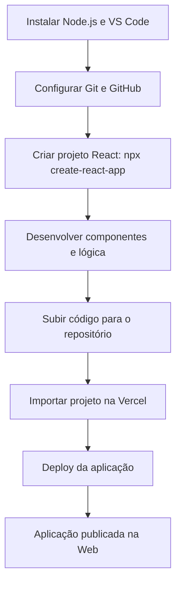

# 📗 Aula 2 - Configuração do Ambiente de Desenvolvimento

> **Disciplina:** Frameworks Front-end
> **Professor:** Prof. Me. Deivison S. Takatu — deivison.takatu@edu.senai.br

## 📑 Índice

1. [Resumo](#-resumo)
2. [Tópicos Abordados](#-tópicos-abordados)
3. [Atividades Apresentadas](#-atividades-apresentadas)
4. [Repositório de Exemplo](#-repositorio-de-exemplo-atividade-02)
5. [Checklist da Aula](#-checklist-da-aula)

---

## 📝 Resumo

A segunda aula foi dedicada à **Configuração do Ambiente de Desenvolvimento**, preparando a máquina e as ferramentas necessárias para o desenvolvimento de aplicações com frameworks Front-end ao longo do semestre. O destaque prático foi a criação de um projeto em **React**, tema central da Atividade 02.

## 📚 Tópicos Abordados

### 1. 🧰 Ferramentas do ecossistema Front-end
- **Editor de código:** Visual Studio Code (VS Code) como IDE principal, com extensões úteis (ESLint, Prettier, Live Server).
- **Node.js e npm:** ambiente de execução JavaScript e gerenciador de pacotes para instalar dependências e rodar projetos.
- **Git e GitHub:** versionamento de código, criação de repositórios e colaboração em equipe.
- **Navegador:** inspeção de elementos, console e ferramentas de desenvolvedor (DevTools).

### 2. ⚙️ Instalação e preparação do ambiente
- Download e instalação do Node.js (LTS) e verificação das versões via terminal (`node -v` e `npm -v`).
- Instalação e configuração do VS Code.
- Configuração das chaves SSH ou autenticação por token no GitHub.
- Verificação do funcionamento do Git (`git --version`).

### 3. ⚛️ Criação do primeiro projeto com React
- Uso do **Create React App** (`npx create-react-app`) ou do **Vite** para inicializar um projeto React.
- Estrutura de pastas de um projeto React (`src`, `public`, `package.json`).
- Componentes, estado (`useState`) e ciclo de vida/efeitos (`useEffect`) como base da biblioteca.
- Execução do servidor de desenvolvimento (`npm start`) e visualização no navegador.

### 4. 🚀 Deploy de aplicações React
- Construção do build de produção (`npm run build`).
- Publicação na **Vercel** importando o repositório do GitHub.
- Diferença entre ambiente de desenvolvimento e ambiente de produção.

### 5. 🧪 Metodologia e boas práticas
- Organização do código em componentes reutilizáveis.
- Padronização com ESLint/Prettier.
- Commits claros e trabalho em equipe via branches.

## 🧪 Atividades Apresentadas

### Atividade 01
Criar um projeto em **Vanilla JS** (HTML, CSS e JavaScript), conectar o IDE ao GitHub e realizar o **deploy** da aplicação pela ferramenta **Vercel**.

> [!NOTE]
> A Atividade 01 foi desenvolvida como um jogo *point-and-click* em JavaScript puro, publicado na Vercel.

### Atividade 02
- Formar grupos de 3 a 5 integrantes (mesma composição para as atividades semanais).
- Criar um repositório no GitHub como diretório principal das atividades do semestre.
- Criar um arquivo Markdown (`.md`) com o resumo desta **Aula 2 - Configuração do Ambiente de Desenvolvimento**.
- Em grupo, desenvolver um projeto prático em **React** (framework escolhido), publicando-o na Vercel e documentando-o em um arquivo Markdown.

> [!NOTE]
> A Atividade 02 foi desenvolvida como o jogo **"Sapo na Estrada"** em React (estilo Frogger), publicado na Vercel. O relatório/resumo da atividade está disponível no arquivo [`Atividade02.md`](../Atividades/Atividade02.md).

### Fluxo da Atividade 02 (React → Deploy)

## 🔗 Repositório de Exemplo (Atividade 02)

A Atividade 02 foi desenvolvida no repetojorio abaixo, que contém o jogo **"Sapo na Estrada"** em React (estilo Frogger):

🔗 **Repositório:** https://github.com/Felipe-Pinheiro-Lopes/projeto-react
🌐 **Deploy (Vercel):** https://projeto-react-felipe-pl.vercel.app/

Esse repositório reúne o projeto prático da disciplina, utilizando **React** (componentes, `useState`, `useEffect` e Canvas API), com deploy realizado via Vercel. O resumo da atividade está em [`Atividade02.md`](../Atividades/Atividade02.md).

## ✅ Checklist da Aula

- [x] Anotar os tópicos de configuração do ambiente
- [x] Instalar Node.js, VS Code e configurar Git/GitHub
- [x] Entender a estrutura de um projeto React
- [x] Concluir a Atividade 02 (projeto em React + deploy na Vercel)
- [x] Criar o resumo da Aula 2 - Configuração do Ambiente (este arquivo)
- [x] Gerar o relatório da Atividade 02 em Markdown ([`Atividade02.md`](../Atividades/Atividade02.md))
