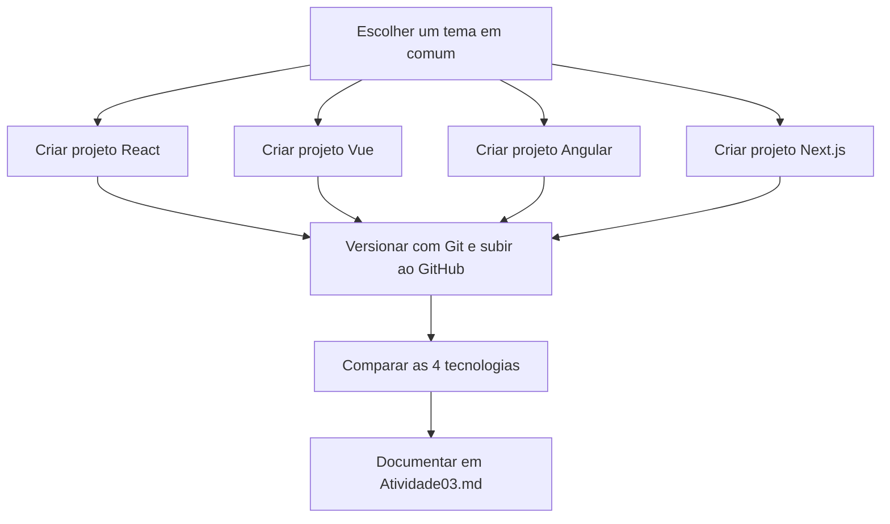

# 📙 Aula 3 - Projetos com Frameworks Front-end

> **Disciplina:** Frameworks Front-end
> **Professor:** Prof. Me. Deivison S. Takatu — deivison.takatu@edu.senai.br

## 📑 Índice

1. [Resumo](#-resumo)
2. [Tópicos Abordados](#-tópicos-abordados)
3. [Atividades Apresentadas](#-atividades-apresentadas)
4. [Repositórios de Exemplo](#-repositórios-de-exemplo-atividade-03)
5. [Checklist da Aula](#-checklist-da-aula)

---

## 📝 Resumo

A terceira aula aprofundou o **desenvolvimento de projetos com Frameworks Front-end**, comparando os principais ecossistemas do mercado — **React, Vue, Angular e Next.js** — e demonstrando na prática a criação e a estrutura de projetos em cada tecnologia. O destaque prático foi a **Atividade 03**, que consiste em desenvolver, em grupo, quatro projetos Web sobre o mesmo tema, um em cada framework, versionando com Git/GitHub e comparando as tecnologias.

## 📚 Tópicos Abordados

### 1. 🧩 Introdução aos Frameworks Front-end
- Um framework é um conjunto de ferramentas, bibliotecas e convenções que padronizam o desenvolvimento de interfaces web.
- **Sem framework (Vanilla JS):** código manual, difícil manutenção e repetição.
- **Com framework:** componentes reutilizáveis, estado gerenciado e atualizações eficientes da UI.

### 2. 🔁 Framework × Biblioteca
- **Framework:** controla o fluxo (inversão de controle), exige estrutura definida — exemplos: Angular, Vue.
- **Biblioteca:** você controla quando chamar, é flexível, sem imposições — exemplos: React, jQuery.
- Exemplo prático: com biblioteca você chama `ReactDOM.render()` quando quiser; com framework (Angular) ele decide quando renderizar.

### 3. 🚀 Por que utilizar um Framework?
- **Produtividade:** evita reinventar a roda (roteamento, estado, renderização).
- **Melhores práticas:** código organizado em componentes.
- **Manutenção facilitada:** Virtual DOM (React), Change Detection (Angular), otimizações internas.
- **Comunidade e suporte:** documentação extensa, plugins e soluções prontas.

### 4. 🏷️ Exemplos de Frameworks
- **React:** biblioteca (Facebook, 2013) para construir interfaces com componentes reutilizáveis; baseada em Virtual DOM.
- **Angular:** framework completo (Google) para SPAs, com TypeScript, MVC e CLI poderosa.
- **Vue.js:** framework progressivo, de fácil adaptação, com Single-File Components (`.vue`).
- **Next.js:** framework baseado em React para aplicações full-stack (SSR, roteamento por arquivos, Server Components).

### 5. 🧬 Características dos Frameworks Front-end
- Estrutura de código organizada e componentização.
- Programação reativa (UI atualizada automaticamente com o estado).
- Ferramentas de build/bundling, sistema de rotas (SPAs) e integração com APIs.
- Documentação/comunidade, padrões de design/acessibilidade e suporte a testes.

### 6. 🛠️ Criação e estrutura de projetos
- **Angular:** `npm install -g @angular/cli` → `ng new meu-app-angular` → `ng serve` (porta 4200). Pastas `src`, `public`, `node_modules`; arquivos `angular.json`, `tsconfig*.json`.
- **Vue:** `npm create vue@latest` → `npm install` → `npm run dev` (Vite). Componentes `.vue`, `App.vue`, `main.ts`, `index.html`.
- **Next:** `npx create-next-app@latest` → `npm run dev`. Estrutura baseada em `app/` (App Router), com páginas e layouts definidos por pastas.

### 7. 📥 Importando projetos (Git e versionamento)
- Projetos-modelo aceleram o desenvolvimento: buscar em **GitHub** (`git clone <url>`), **Vercel Templates** e **CodeSandbox**.
- Durante o desenvolvimento, versionar com Git e publicar no GitHub, mantendo histórico de commits.

## 🧪 Atividades Apresentadas

### Atividade 03
Desenvolver, em grupo, **quatro projetos Web sobre o mesmo tema**, utilizando **React, Vue, Angular e Next.js**. Cada projeto deve apresentar uma página funcional, responsiva e organizada, usando componentes e os recursos básicos da tecnologia escolhida.

- Versionar com Git e publicar no GitHub, mantendo histórico de commits.
- Organizar cada projeto em seu respectivo repositório e elaborar uma breve **comparação entre as quatro tecnologias**.
- **Entregas:** Projeto 01 (React), Projeto 02 (Vue), Projeto 03 (Angular), Projeto 04 (Next.js) e Projeto 05 (cópia de um projeto a partir de um repositório).

> [!NOTE]
> A Atividade 03 foi iniciada a partir dos quatro projetos clonados localmente (React, Vue, Angular e Next.js). O relatório/resumo da atividade está disponível no arquivo [`Atividade03.md`](../Atividades/Atividade03.md).

### Fluxo da Atividade 03 (4 Frameworks → GitHub)

## 🔗 Repositórios de Exemplo (Atividade 03)

Os quatro projetos da Atividade 03 foram criados a partir dos repositórios clonados localmente em `C:\Users\Felipe Lopes\Desktop\frontend-atividades`:

| Framework | Repositório (GitHub) | Deploy (Vercel) | Comando de execução |
| --- | --- | --- | --- |
| ⚛️ React | [`projeto-react-01`](https://github.com/biancaciriloads/projeto-react-01) | ✅ [`projeto-react-01-three.vercel.app`](https://projeto-react-01-three.vercel.app) | `npm start` (porta 3000) |
| 💚 Vue | [`projeto-vue`](https://github.com/RickRazz0/projeto-vue) | ✅ [`projeto-vue-vert.vercel.app`](https://projeto-vue-vert.vercel.app) | `npm run dev` (Vite) |
| 🅰️ Angular | [`meu-app-angular`](https://github.com/Nickddb/meu-app-angular) | ✅ [`meu-app-angular-omega.vercel.app`](https://meu-app-angular-omega.vercel.app) | `ng serve` (porta 4200) |
| ▲ Next.js | [`projeto-next`](https://github.com/Felipe-Pinheiro-Lopes/projeto-next) | ✅ [`projeto-next-nu.vercel.app`](https://projeto-next-nu.vercel.app) | `npm run dev` (porta 3000) |

Esses repositórios reúnem os projetos práticos da disciplina, um em cada framework, com versionamento Git/GitHub e deploy previsto na Vercel. Os projetos também foram clonados localmente em `C:\Users\Felipe Lopes\Desktop\frontend-atividades`. O resumo da atividade está em [`Atividade03.md`](../Atividades/Atividade03.md).

## ✅ Checklist da Aula

- [x] Entender a diferença entre Framework e Biblioteca
- [x] Conhecer React, Vue, Angular e Next.js
- [x] Comparar os principais frameworks Front-end
- [x] Criar a estrutura de projetos em Angular, Vue e Next.js
- [x] Clonar os projetos-modelo para a Atividade 03
- [x] Criar o resumo da Aula 3 - Projetos com Frameworks Front-end (este arquivo)
- [ ] Desenvolver os 4 projetos da Atividade 03 (mesmo tema, 4 frameworks)
- [ ] Versionar com Git/GitHub e publicar na Vercel
- [ ] Elaborar a comparação entre as tecnologias
- [ ] Gerar o relatório da Atividade 03 em Markdown ([`Atividade03.md`](../Atividades/Atividade03.md))
