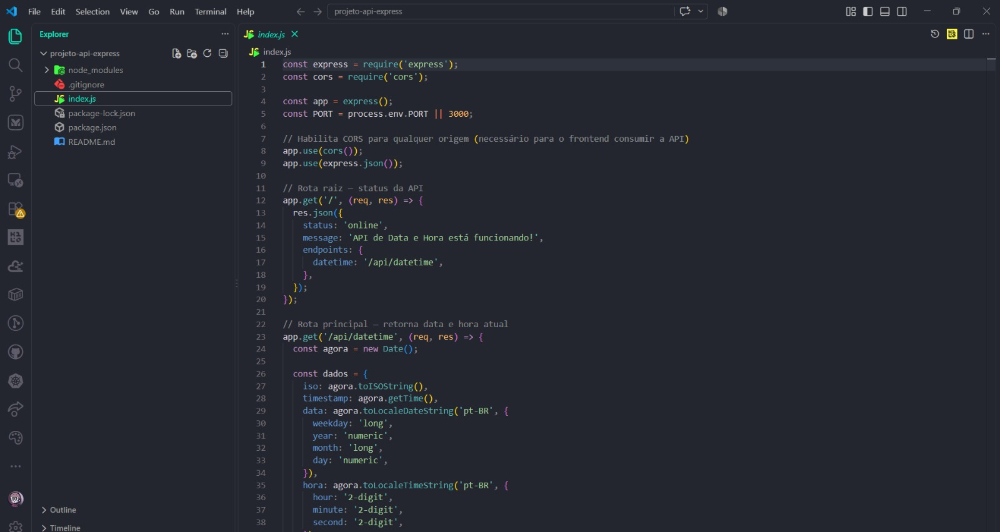
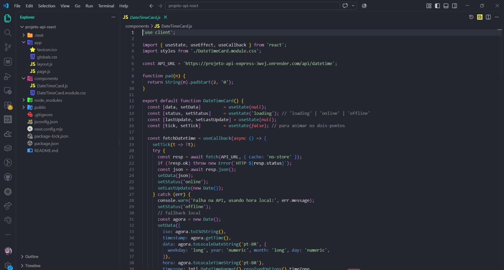
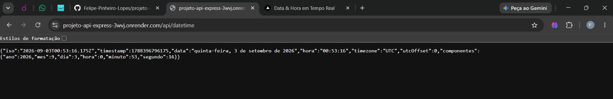
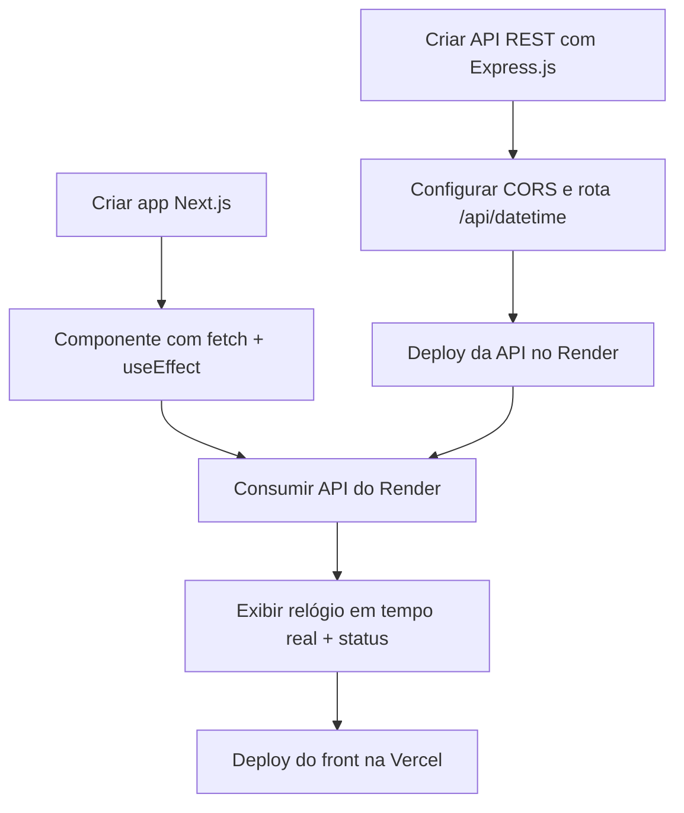
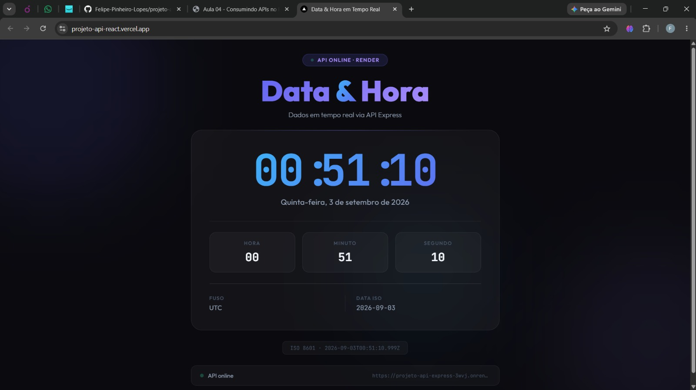

# 📕 Aula 4 - Integração Front-end com APIs

> **Disciplina:** Frameworks Front-end
> **Professor:** Prof. Me. Deivison S. Takatu — deivison.takatu@edu.senai.br

## 📑 Índice

1. [Resumo](#-resumo)
2. [Tópicos Abordados](#-tópicos-abordados)
3. [Atividades Apresentadas](#-atividades-apresentadas)
4. [Repositórios de Exemplo](#-repositórios-de-exemplo-atividade-42)
5. [Checklist da Aula](#-checklist-da-aula)

---

## 📝 Resumo

A quarta aula foi dedicada à **integração entre o Front-end e APIs REST**, abordando como aplicações modernas se comunicam com serviços de backend. O destaque prático foi a **Atividade 4-2**, que consiste em construir uma API REST com **Express.js** (Node.js) e consumi-la a partir de um front-end em **Next.js**, realizando deploy da API no **Render** e do front no **Vercel**.

## 📚 Tópicos Abordados

### 1. 🌐 O que é uma API REST?
- **API (Application Programming Interface):** contrato que permite a comunicação entre sistemas diferentes.
- **REST (Representational State Transfer):** estilo arquitetural que usa os verbos HTTP (`GET`, `POST`, `PUT`, `DELETE`) para operações sobre recursos.
- **JSON:** formato padrão de troca de dados entre front-end e back-end.

### 2. 🔁 Arquitetura Cliente-Servidor
- **Frontend (cliente):** responsável pela interface e pela experiência do usuário; faz requisições para o servidor.
- **Backend (servidor):** processa regras de negócio, acessa banco de dados e devolve respostas ao cliente.
- **Separação de responsabilidades:** permite escalar, testar e evoluir cada camada de forma independente.

### 3. ⚡ Express.js — API com Node.js
- **Express:** framework minimalista para Node.js que facilita a criação de servidores HTTP e rotas REST.
- Criação de endpoints (`app.get`, `app.post`, etc.) e resposta com `res.json()`.
- Configuração de **CORS** para permitir requisições de outros domínios (essencial para integração front-back).
- **Nodemon:** ferramenta de hot-reload para desenvolvimento — reinicia o servidor automaticamente a cada alteração de arquivo.

### 4. ⚛️ Consumo de API com Next.js
- **`fetch` API:** função nativa para realizar requisições HTTP assíncronas no browser e no Node.js.
- **`useEffect`** (React Hook): executa efeitos colaterais (como chamadas de API) após a renderização do componente.
- **`useState`** (React Hook): armazena e atualiza dados recebidos da API no estado local do componente.
- **Fallback / tratamento de erros:** lidar com falhas de rede exibindo dados locais ou mensagens de status.

### 5. ☁️ Deploy de API — Render
- **Render:** plataforma de deploy para serviços Node.js (e outros back-ends), com tier gratuito.
- O serviço gratuito entra em **modo inativo** após 15 min sem uso; a primeira requisição pode demorar ~30s para "acordar".
- Variáveis de ambiente (`PORT`) são configuradas na dashboard do Render.

### 6. ▲ Deploy do Front-end — Vercel
- **Vercel:** plataforma otimizada para aplicações Next.js e frameworks modernos; integração automática com GitHub.
- Cada *push* para o repositório dispara um novo deploy automático.
- Configuração de variáveis de ambiente para apontar para a URL da API em produção.

### 7. 🔗 Integração Completa (Full-Stack Básico)
- Fluxo: **Usuário → Next.js (Vercel)** → faz `fetch` → **API Express (Render)** → retorna JSON → **Next.js** exibe os dados.
- Indicadores de status de conexão (online, offline, conectando) para melhorar a experiência do usuário.
- Boas práticas: separar responsabilidades, validar dados na API, tratar erros no front-end.

## 🧪 Atividades Apresentadas

### Atividade 4-1
Pesquisar e comparar **10 repositórios do GitHub** que consomem APIs públicas sem autenticação, utilizando tecnologias modernas (Next.js, Vite, Angular, etc.).

> [!NOTE]
> A Atividade 4-1 resultou em uma tabela comparativa com 10 projetos reais de referência (Pokédex, Países, Filmes, etc.) documentada no arquivo [`Atividade-4-1.md`](../Atividades/Aula%204/Atividade-4-1.md).

### Atividade 4-2
Construir uma aplicação **full-stack básica** composta por:
- **API REST** com Node.js e Express (`GET /api/datetime`) retornando data e hora formatadas em PT-BR.
- **Frontend Next.js** que consome a API a cada 1 segundo e exibe um relógio em tempo real com indicador de status da API.
- Deploy da API no **Render** e do frontend na **Vercel**.

> [!NOTE]
> A Atividade 4-2 foi desenvolvida nos repositórios `projeto-api-express` e `projeto-api-react`. O relatório está em [`Atividade-4-2.md`](../Atividades/Aula%204/Atividade-4-2.md).

### Fluxo da Atividade 4-2 (Express + Next.js → Deploy)

## 🔗 Repositórios de Exemplo (Atividade 4-2)

| Camada | Repositório (GitHub) | Deploy | Tecnologia |
| --- | --- | --- | --- |
| 🖥️ Frontend | [`projeto-api-react`](https://github.com/Felipe-Pinheiro-Lopes/projeto-api-react) | ✅ [projeto-api-react.vercel.app](https://projeto-api-react.vercel.app/) | Next.js 16 (Vercel) |
| ⚙️ API | [`projeto-api-express`](https://github.com/Felipe-Pinheiro-Lopes/projeto-api-express) | ✅ [Render](https://projeto-api-express-3wvj.onrender.com) | Node.js + Express (Render) |

O resumo da atividade está em [`Atividade-4-2.md`](../Atividades/Aula%204/Atividade-4-2.md).

## ✅ Checklist da Aula

- [x] Entender o conceito de API REST e arquitetura cliente-servidor
- [x] Compreender como o Express.js cria servidores e rotas
- [x] Usar `fetch`, `useState` e `useEffect` para consumir APIs no Next.js
- [x] Configurar CORS para integração cross-origin
- [x] Realizar deploy da API no Render
- [x] Realizar deploy do frontend na Vercel
- [x] Concluir a Atividade 4-1 (comparação de repositórios)
- [x] Concluir a Atividade 4-2 (projeto full-stack Express + Next.js)
- [x] Criar o resumo da Aula 4 - Integração Front-end com APIs (este arquivo)
- [x] Gerar o relatório da Atividade 4-2 em Markdown ([`Atividade-4-2.md`](../Atividades/Aula%204/Atividade-4-2.md))
