# 📒 Aula 5 - Criando APIs para o Front-end

> **Disciplina:** Frameworks Front-end
> **Professor:** Prof. Me. Deivison S. Takatu — deivison.takatu@edu.senai.br

## 📑 Índice

1. [Resumo](#-resumo)
2. [Tópicos Abordados](#-tópicos-abordados)
3. [Atividades Apresentadas](#-atividades-apresentadas)
4. [Repositórios de Exemplo](#-repositórios-de-exemplo-atividade-52)
5. [Checklist da Aula](#-checklist-da-aula)

---

## 📝 Resumo

A quinta aula foi dedicada à **criação de APIs REST para consumo por front-ends**, utilizando **Node.js com Express.js**. O destaque prático foi a **Atividade 5-2**, que consiste em construir uma API de notas com operações **CRUD** (Create, Read, Update, Delete) e consumi-la a partir de um front-end em **Next.js**, realizando deploy da API no **Render** e do front no **Vercel**.

Esta atividade exercita os conceitos de **middlewares, CORS, manipulação de arquivos JSON com Node.js, geração de IDs únicos com UUID, operações CRUD e deploy full-stack** abordados na Aula 5 - Criando APIs para o Front-end.

## 📚 Tópicos Abordados

### 1. ⚡ Express.js — Criação de APIs REST
- **Express:** framework minimalista para Node.js que facilita a criação de servidores HTTP e rotas REST.
- Criação de endpoints com `app.get`, `app.post`, `app.put` e `app.delete`.
- Respostas padronizadas com `res.json()` e códigos HTTP apropriados (`200`, `201`, `400`, `404`).
- Configuração de **middlewares**: `cors()` para requisições cross-origin e `express.json()` para parsear JSON no body.

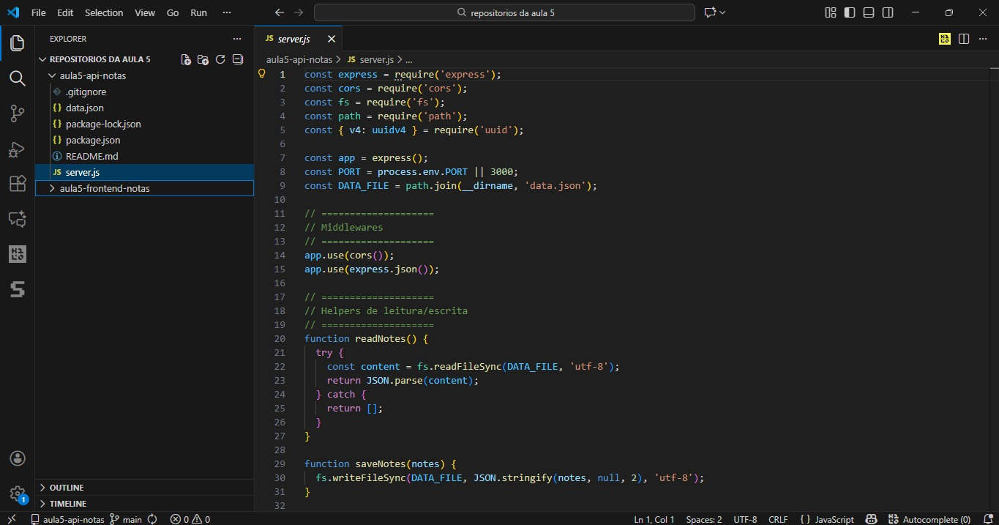

### 2. 🗂️ Manipulação de Arquivos com Node.js
- Uso do módulo nativo `fs` (file system) para leitura e escrita síncrona de arquivos JSON.
- Funções helper `readNotes()` e `saveNotes()` para abstrair a persistência local em `data.json`.
- Estrutura do `data.json` como "banco de dados" local em formato JSON array.

### 3. 🆔 Identificadores Únicos com UUID
- **UUID (Universally Unique Identifier):** garante IDs únicos para cada recurso criado.
- Biblioteca `uuid` para gerar IDs no formato `xxxxxxxx-xxxx-xxxx-xxxx-xxxxxxxxxxxx`.
- Vantagem sobre IDs incrementais: não expõe quantidade de registros e evita colisões.

### 4. 🔄 Operações CRUD
- **CREATE:** `POST /api/notes` — cria nova nota com `titulo` e `texto`.
- **READ:** `GET /api/notes` — lista todas as notas; `GET /api/notes/:id` — busca nota específica.
- **UPDATE:** `PUT /api/notes/:id` — atualiza `titulo` e `texto` de uma nota existente.
- **DELETE:** `DELETE /api/notes/:id` — remove nota por ID.

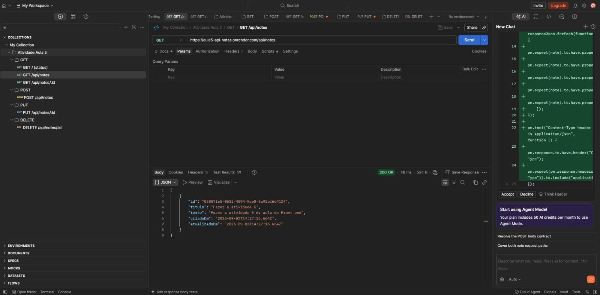

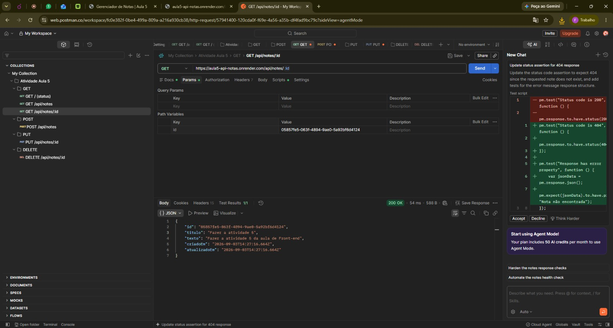

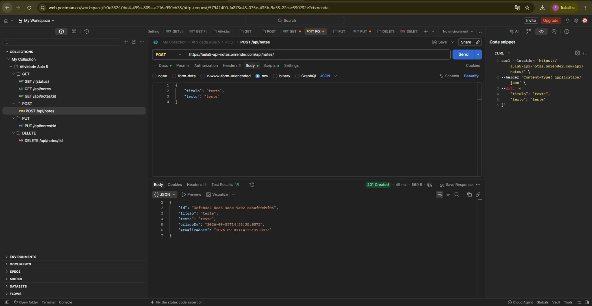

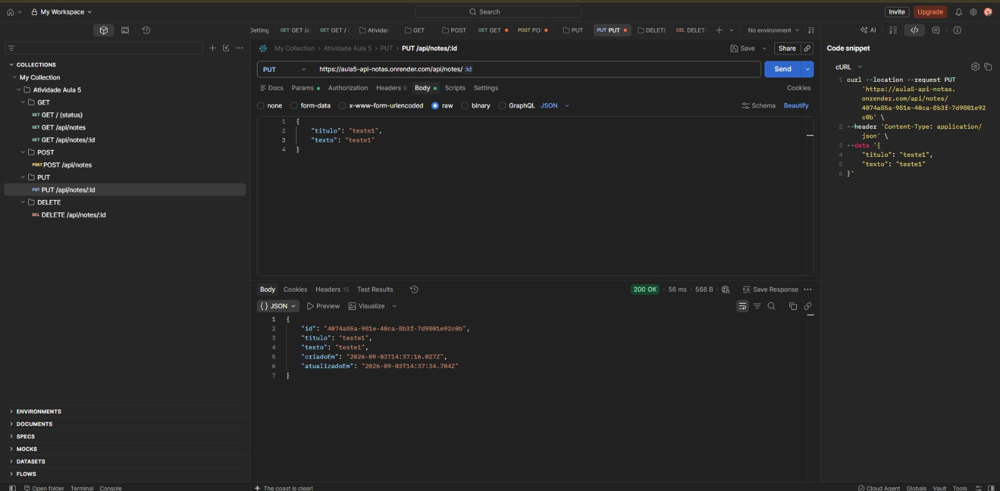

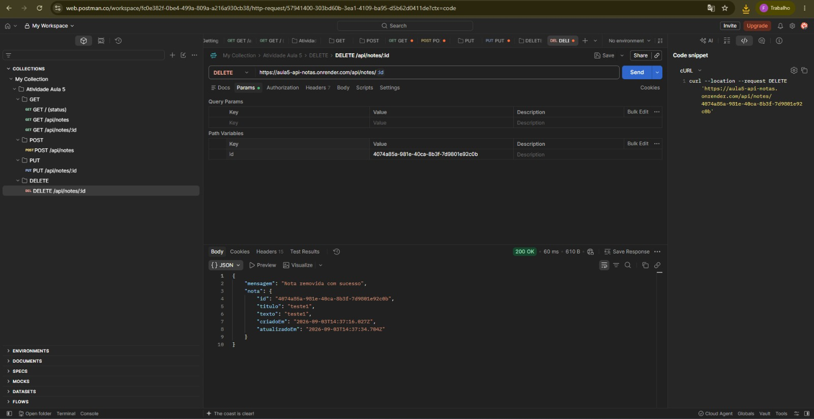

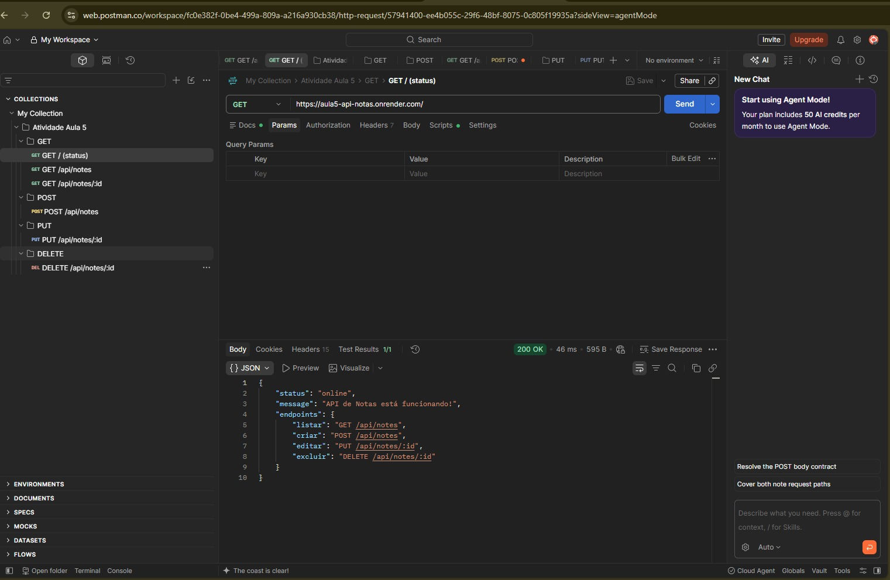

### 5. ☁️ Deploy de API — Render
- **Render:** plataforma de deploy para serviços Node.js com tier gratuito.
- Configuração de **Build Command** (`npm install`) e **Start Command** (`node server.js`).
- Variáveis de ambiente (`PORT`) gerenciadas automaticamente pela plataforma.
- O serviço gratuito entra em **modo inativo** após 15 min sem uso.

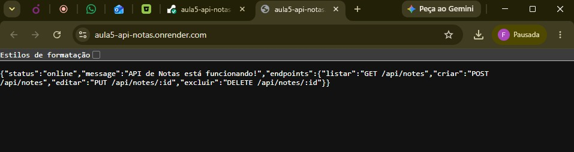

### 6. ▲ Deploy do Front-end — Vercel
- **Vercel:** plataforma otimizada para aplicações Next.js e frameworks modernos.
- Integração automática com GitHub para deploys contínuos.
- Configuração de variáveis de ambiente (`NEXT_PUBLIC_API_URL`) para apontar para a URL da API em produção.

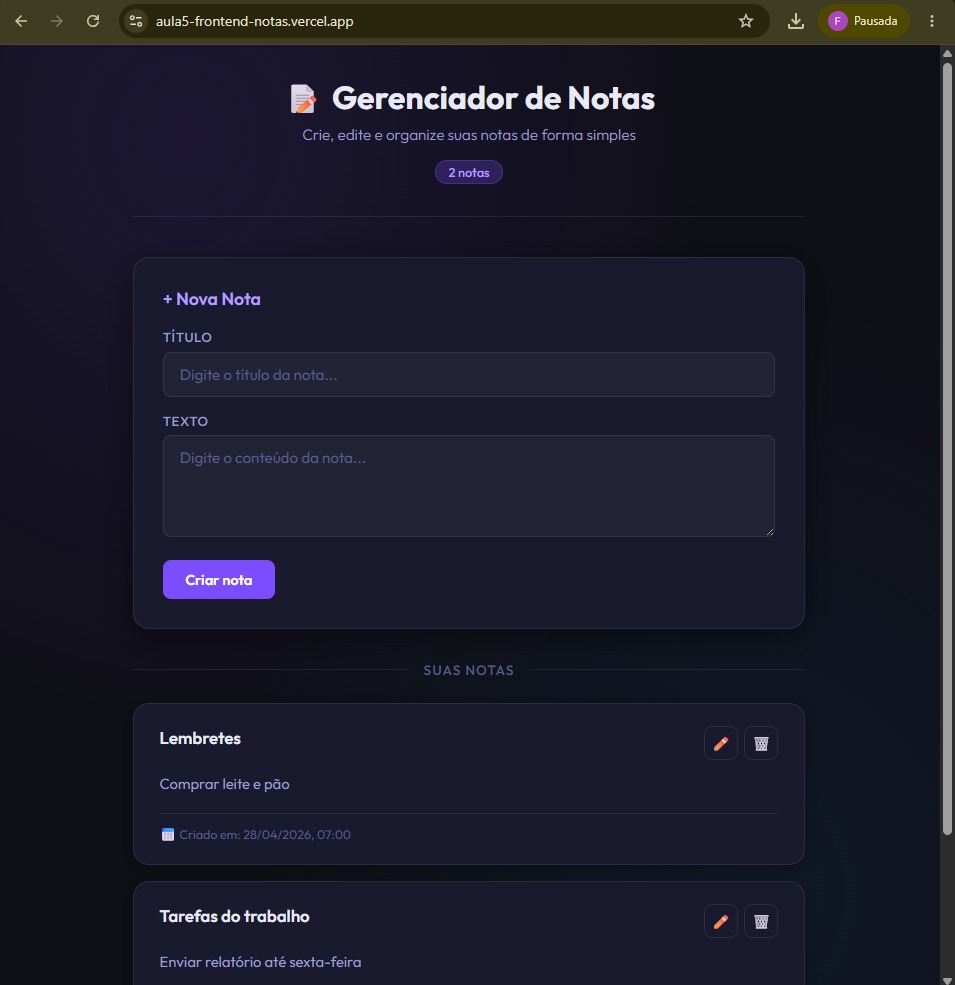

### 7. 🔗 Integração Completa (Full-Stack com CRUD)
- Fluxo: **Usuário → Next.js (Vercel)** → faz `fetch` → **API Express (Render)** → realiza CRUD em `data.json` → **Next.js** atualiza a interface.
- Separação clara entre backend (regras de negócio e persistência) e frontend (interface e experiência do usuário).
- Boas práticas: validação de dados na API, tratamento de erros no front-end, feedback visual para o usuário.

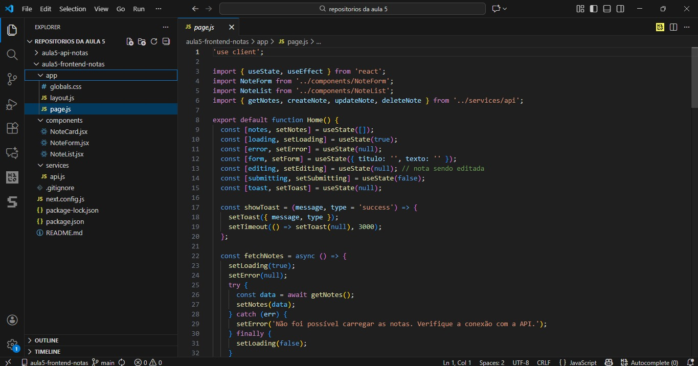

## 🧪 Atividades Apresentadas

### Atividade 5-2
Construir uma aplicação **full-stack com CRUD de notas** composta por:
- **API REST** com Node.js e Express (`GET`, `POST`, `PUT`, `DELETE` em `/api/notes`) com persistência em `data.json` e IDs UUID.
- **Frontend Next.js** que consome a API e permite listar, criar, editar e excluir notas com feedback visual.
- Deploy da API no **Render** e do frontend na **Vercel**.

> [!NOTE]
> A Atividade 5-2 foi desenvolvida nos repositórios `aula5-api-notas` e `aula5-frontend-notas`. O relatório está em [`Atividade-5-2.md`](../Atividades/Aula%205/Atividade-5-2.md).

### Fluxo da Atividade 5-2 (Express CRUD + Next.js → Deploy)

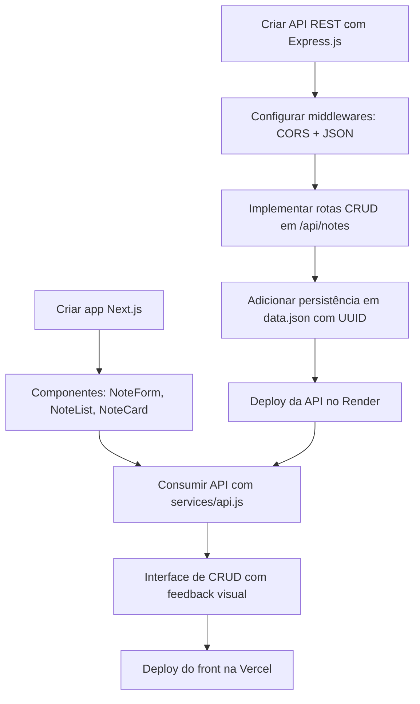

## 🔗 Repositórios de Exemplo (Atividade 5-2)

| Camada | Repositório (GitHub) | Deploy | Tecnologia |
| --- | --- | --- | --- |
| ⚙️ API (Backend) | [`aula5-api-notas`](https://github.com/Felipe-Pinheiro-Lopes/aula5-api-notas) | [aula5-api-notas.onrender.com](https://aula5-api-notas.onrender.com/) | Node.js + Express |
| 🖥️ Frontend | [`aula5-frontend-notas`](https://github.com/Felipe-Pinheiro-Lopes/aula5-frontend-notas) | [aula5-frontend-notas.vercel.app](https://aula5-frontend-notas.vercel.app/) | Next.js 16 + React |

O resumo da atividade está em [`Atividade-5-2.md`](../Atividades/Aula%205/Atividade-5-2.md).

## ✅ Checklist da Aula

- [x] Entender o papel de uma API REST na arquitetura cliente-servidor
- [x] Aprender a criar endpoints com Express.js
- [x] Configurar middlewares CORS e `express.json()`
- [x] Implementar operações CRUD (GET, POST, PUT, DELETE)
- [x] Utilizar `fs` para persistência local em JSON
- [x] Gerar IDs únicos com a biblioteca `uuid`
- [x] Realizar deploy da API no Render
- [x] Consumir API REST com `fetch` no Next.js
- [x] Gerenciar estado com `useState` e `useEffect`
- [x] Implementar tratamento de erros e feedback visual no front-end
- [x] Realizar deploy do frontend na Vercel
- [x] Concluir a Atividade 5-2 (CRUD de notas com Express + Next.js)
- [x] Criar o resumo da Aula 5 - Criando APIs para o Front-end (este arquivo)
