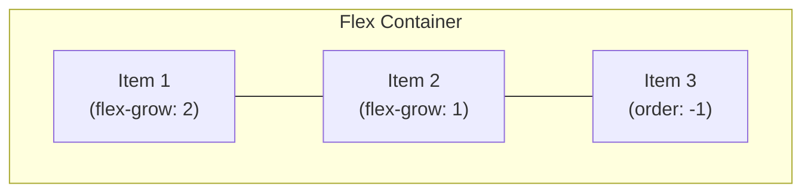
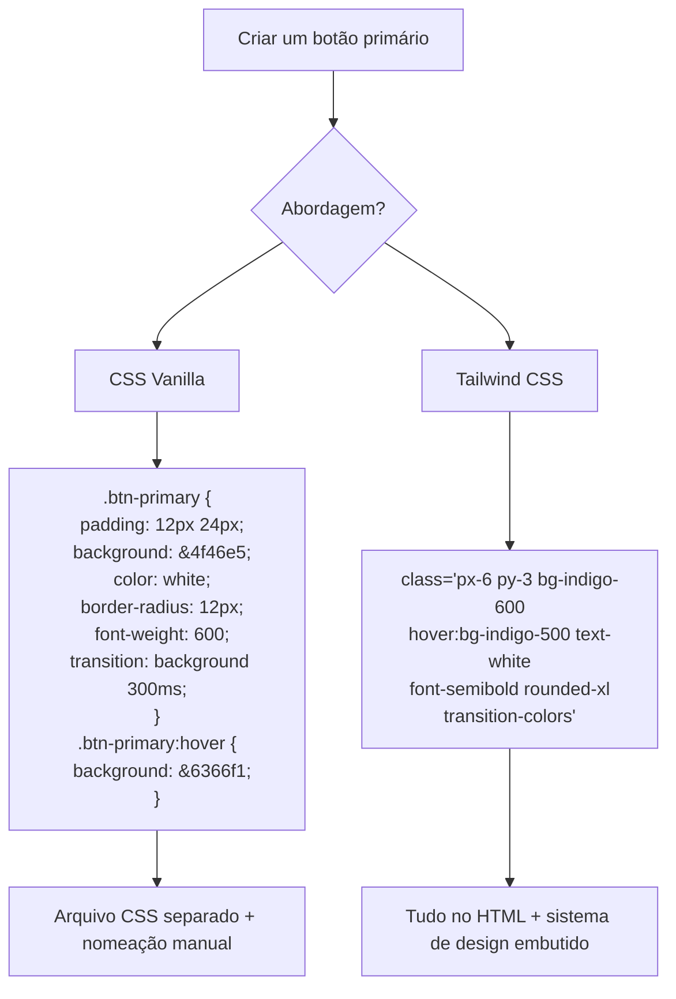
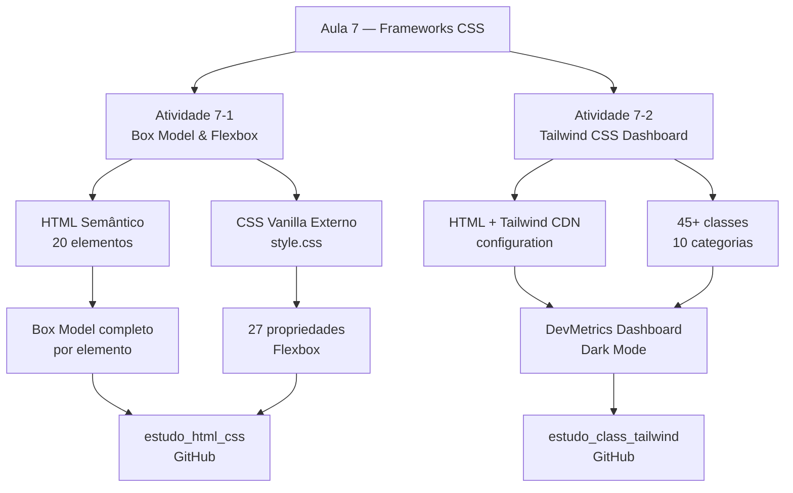

# 🎨 Aula 7 - Frameworks CSS

> **Disciplina:** Frameworks Front-end
> **Professor:** Prof. Me. Deivison S. Takatu — deivison.takatu@edu.senai.br


## 📑 Índice

1. [Resumo](#-resumo)
2. [Tópicos Abordados](#-tópicos-abordados)
3. [Atividades Apresentadas](#-atividades-apresentadas)
4. [Repositórios das Atividades](#-repositórios-das-atividades)
5. [Checklist da Aula](#-checklist-da-aula)

---

## 📝 Resumo

A sétima aula abordou os **Frameworks CSS** em duas frentes complementares. Na primeira parte, o foco foi revisar e aprofundar os fundamentos do CSS puro: o **CSS Box Model** (Content, Padding, Border, Margin) e o **CSS Flexbox** com suas principais propriedades de layout — culminando na Atividade 7-1, que exigiu a criação de uma página com 20 elementos usando Box Model completo e 27 propriedades Flexbox em CSS Vanilla. Na segunda parte, foi introduzido o **Tailwind CSS**, um framework utilitário que substitui a escrita de CSS personalizado por classes diretamente no HTML, acelerando o desenvolvimento e garantindo consistência visual — exercitado na Atividade 7-2, que resultou no **DevMetrics Dashboard** com mais de 45 classes utilitárias.

## 📚 Tópicos Abordados

### 1. 📦 CSS Box Model

O Box Model é o modelo fundamental que define como cada elemento HTML ocupa espaço na página. É composto por quatro camadas concêntricas:

- **Content** — área onde o conteúdo é exibido (texto, imagens). Controlada por `width`, `height`, `max-width`, etc.
- **Padding** — espaço interno entre o conteúdo e a borda. Controlado por `padding`, `padding-top`, `padding-inline`, etc.
- **Border** — linha ao redor do padding. Controlada por `border`, `border-width`, `border-style`, `border-color`, `border-radius`.
- **Margin** — espaço externo entre a borda e os elementos vizinhos. Controlado por `margin`, `margin-top`, `margin-inline`, etc.

```
┌──────────────────────────────────┐
│            MARGIN                │
│  ┌────────────────────────────┐  │
│  │          BORDER            │  │
│  │  ┌──────────────────────┐  │  │
│  │  │       PADDING        │  │  │
│  │  │  ┌────────────────┐  │  │  │
│  │  │  │    CONTENT     │  │  │  │
│  │  │  └────────────────┘  │  │  │
│  │  └──────────────────────┘  │  │
│  └────────────────────────────┘  │
└──────────────────────────────────┘
```

> [!IMPORTANT]
> Por padrão, o CSS usa `box-sizing: content-box`, onde `width` e `height` definem apenas o Content. Com `box-sizing: border-box`, o `width` inclui Content + Padding + Border, tornando o cálculo de layouts muito mais previsível — é o padrão adotado pelo Tailwind CSS e pela maioria dos frameworks modernos.

### 2. 💪 CSS Flexbox

O Flexbox é um modelo de layout unidimensional (uma direção por vez: linha ou coluna) que permite distribuir e alinhar elementos de forma flexível dentro de um container.

**Propriedades do Container Flex:**

| Propriedade | Valores Principais | Função |
|:---|:---|:---|
| `display` | `flex` / `inline-flex` | Ativa o contexto Flexbox |
| `flex-direction` | `row` / `column` / `row-reverse` / `column-reverse` | Define a direção principal |
| `flex-wrap` | `nowrap` / `wrap` / `wrap-reverse` | Controla a quebra de linha |
| `flex-flow` | `<direction> <wrap>` | Atalho para direction + wrap |
| `justify-content` | `flex-start` / `center` / `space-between` / `space-around` / `space-evenly` | Distribui itens no eixo principal |
| `align-items` | `stretch` / `center` / `flex-start` / `flex-end` | Alinha itens no eixo cruzado |
| `align-content` | `space-between` / `center` / etc. | Alinha linhas múltiplas |
| `gap` / `row-gap` / `column-gap` | valores em px/rem | Espaçamento nativo entre itens |

**Propriedades dos Itens Flex:**

| Propriedade | Valores Principais | Função |
|:---|:---|:---|
| `flex-grow` | número | Fator de crescimento no espaço disponível |
| `flex-shrink` | número | Fator de encolhimento quando espaço falta |
| `flex-basis` | tamanho / `auto` | Dimensão base antes da distribuição |
| `flex` | `grow shrink basis` | Atalho para os três acima |
| `align-self` | mesmos de `align-items` | Sobrescreve o alinhamento individual |
| `order` | número inteiro | Reordena visualmente sem mudar o HTML |



### 3. 🎨 Frameworks CSS — Visão Geral

Um **framework CSS** é uma coleção de estilos, componentes e convenções pré-construídas que aceleram o desenvolvimento de interfaces e garantem consistência visual. Os principais modelos são:

| Tipo | Exemplos | Abordagem |
|:---|:---|:---|
| **Componentes prontos** | Bootstrap, Bulma | Classes de componentes (`btn`, `card`, `navbar`) |
| **Utilitário** | Tailwind CSS, UnoCSS | Classes de baixo nível (`flex`, `p-4`, `text-lg`) |
| **CSS-in-JS** | Styled Components, Emotion | CSS encapsulado em componentes JavaScript |
| **Módulos CSS** | CSS Modules | Escopo local de classes por arquivo |

### 4. 🌊 Tailwind CSS — Framework Utilitário

O **Tailwind CSS** adota uma abordagem *utility-first*: em vez de criar classes semânticas como `.card` ou `.button`, você compõe o design aplicando classes atômicas diretamente no HTML:

```html
<!-- Bootstrap (componente pré-definido) -->
<button class="btn btn-primary btn-lg">Salvar</button>

<!-- Tailwind CSS (composição de utilitários) -->
<button class="px-6 py-3 rounded-xl bg-indigo-600 hover:bg-indigo-500 text-white font-semibold transition-colors">
  Salvar
</button>
```

**Vantagens do Tailwind:**
- ✅ Sem necessidade de nomear classes CSS personalizadas.
- ✅ Design system consistente via escala de valores predefinidos.
- ✅ Responsividade mobile-first com prefixos (`sm:`, `md:`, `lg:`, `xl:`).
- ✅ Estados interativos sem JavaScript extra (`hover:`, `focus:`, `active:`, `group-hover:`).
- ✅ Bundle mínimo em produção (PurgeCSS remove classes não utilizadas).
- ✅ Dark mode integrado com `dark:` ou `darkMode: 'class'`.

### 5. 📐 Sistema de Design do Tailwind

O Tailwind utiliza uma escala de valores consistente para espaçamento, tipografia e cores:

**Escala de Espaçamento (base 4px):**
| Classe | Valor |
|:---:|:---:|
| `p-1` | 4px |
| `p-2` | 8px |
| `p-4` | 16px |
| `p-6` | 24px |
| `p-8` | 32px |
| `p-12` | 48px |

**Breakpoints (Mobile-First):**
| Prefixo | Tamanho Mínimo |
|:---:|:---:|
| *(sem prefixo)* | 0px (mobile) |
| `sm:` | 640px |
| `md:` | 768px |
| `lg:` | 1024px |
| `xl:` | 1280px |
| `2xl:` | 1536px |

**Escala de Cores:** Tailwind provê paletas completas de 11 tons (50 a 950) para cores como `slate`, `indigo`, `emerald`, `amber`, `violet`, `pink`, `cyan`, etc.

### 6. ⚙️ Configuração e Customização

O Tailwind pode ser estendido via `tailwind.config`:

```javascript
tailwind.config = {
  darkMode: 'class',       // Ativa dark mode por classe
  theme: {
    extend: {
      fontFamily: {
        sans: ['Inter', 'sans-serif'],   // Fonte customizada
      },
      colors: {
        brand: {                          // Paleta de cor personalizada
          500: '#6366f1',
          600: '#4f46e5',
        }
      }
    }
  }
}
```

### 7. 🔄 Tailwind vs. CSS Vanilla — Comparativo



## 🧪 Atividades Apresentadas

### Atividade 7-1 — Box Model & Flexbox (HTML + CSS Puro)
Criar uma página web com **20 elementos HTML** aplicando as quatro camadas do Box Model em cada um, e utilizando pelo menos **20 propriedades distintas de Flexbox** para construir um layout responsivo com Dark Theme e Glassmorphism.

> [!NOTE]
> A Atividade 7-1 foi desenvolvida no repositório `estudo_html_css`. O relatório está em [`Atividade-7-1.md`](../Atividades/Aula%207/Atividade-7-1.md).

### Atividade 7-2 — DevMetrics Dashboard (Tailwind CSS)
Criar uma interface de dashboard moderno utilizando **exclusivamente classes utilitárias do Tailwind CSS v3**, cobrindo pelo menos 8 categorias distintas de classes (cores, tipografia, espaçamento, bordas, flexbox, grid, responsividade e estados interativos).

> [!NOTE]
> A Atividade 7-2 foi desenvolvida no repositório `estudo_class_tailwind`. O relatório está em [`Atividade-7-2.md`](../Atividades/Aula%207/Atividade-7-2.md).

### Fluxo das Atividades da Aula 7



## 🔗 Repositórios das Atividades

| Atividade | Repositório (GitHub) | Tecnologia | Resumo |
|:---|:---|:---|:---|
| 7-1 Box Model & Flexbox | [`estudo_html_css`](https://github.com/Felipe-Pinheiro-Lopes/estudo_html_css) | HTML5 + CSS3 Vanilla | [Atividade-7-1.md](../Atividades/Aula%207/Atividade-7-1.md) |
| 7-2 DevMetrics Dashboard | [`estudo_class_tailwind`](https://github.com/Felipe-Pinheiro-Lopes/estudo_class_tailwind) | HTML5 + Tailwind CSS v3 | [Atividade-7-2.md](../Atividades/Aula%207/Atividade-7-2.md) |

## ✅ Checklist da Aula

- [x] Entender o CSS Box Model e suas quatro camadas (Content, Padding, Border, Margin)
- [x] Compreender `box-sizing: border-box` e sua importância nos frameworks modernos
- [x] Dominar as propriedades do container Flexbox (`justify-content`, `align-items`, `flex-wrap`, etc.)
- [x] Dominar as propriedades dos itens Flexbox (`flex-grow`, `align-self`, `order`, etc.)
- [x] Entender a diferença entre frameworks de componentes e frameworks utilitários
- [x] Aprender a filosofia *utility-first* do Tailwind CSS
- [x] Compreender o sistema de design (escala de espaçamento, cores e breakpoints) do Tailwind
- [x] Aprender a configurar e customizar o Tailwind (`tailwind.config`)
- [x] Utilizar responsividade mobile-first com prefixos `sm:`, `md:`, `lg:`
- [x] Utilizar estados interativos com `hover:`, `active:` e `group`
- [x] Concluir a Atividade 7-1 (Box Model & Flexbox em CSS Vanilla)
- [x] Concluir a Atividade 7-2 (DevMetrics Dashboard com Tailwind CSS)
- [x] Criar o resumo da Aula 7 — Frameworks CSS (este arquivo)
